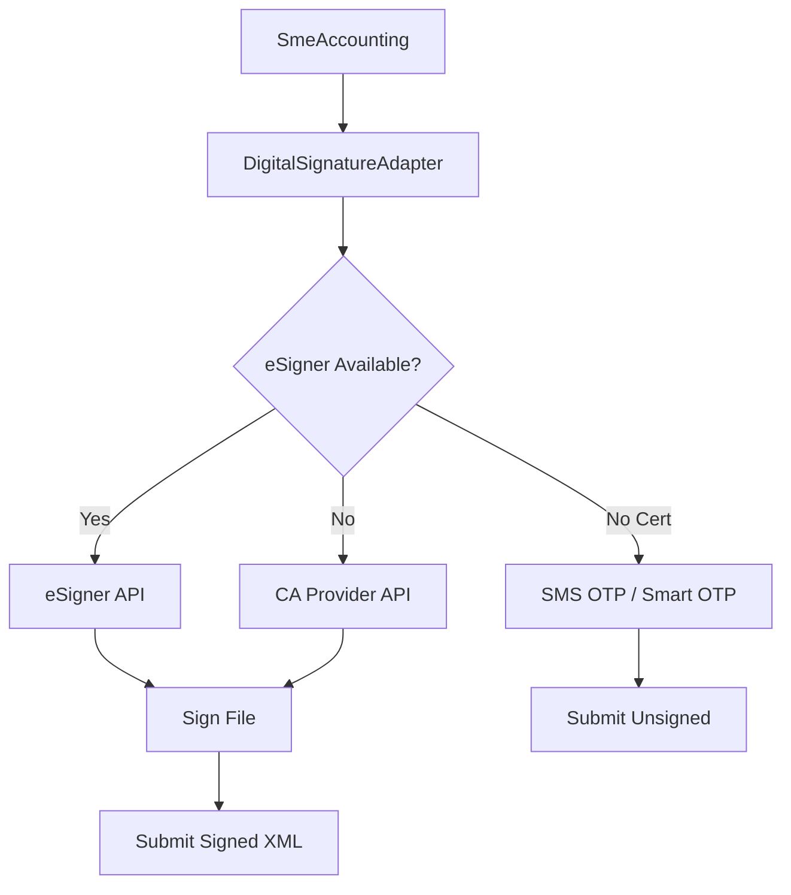

# ADR-0002: Digital Signature Module

**Status:** Proposed
**Date:** 2026-07-16

## Context

NĐ 23/2025/NĐ-CP on electronic signatures and trust services. All tax declarations must be digitally signed using valid certificates from authorized CA providers. Tổng cục Thuế provides eSigner software for this purpose.

## Decision

Implement digital signature module supporting:
1. **Primary**: eSigner integration (Tổng cục Thuế standard)
2. **Alternative**: CA-provided signing APIs (Viettel, BKAV, FPT, etc.)
3. **Fallback**: SMS OTP / Smart OTP for individuals without certs

## Architecture

## Consequences

- Must support PKCS#11 / PKCS#7 signature formats
- Must handle certificate expiration checks
- Must store signed documents with their signatures
- SMS OTP is legally valid only for personal income tax
