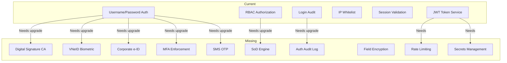

# Authentication & Authorization Module — Wrap-Up

## Sources Consulted

### Vietnamese Government Portals
- [[vbpl.vn]] — National legal database (Luật Giao dịch điện tử 2023, Decree 23/2025)
- [[mof.gov.vn]] — Ministry of Finance (Circular 99/2025/TT-BTC)
- [[gdt.gov.vn]] — General Department of Taxation (Official Letter 3078/CT-NVT)
- [[thuedientu.gdt.gov.vn]] — Tax e-portal (biometric facial verification mandate)
- [[dichvucong.gov.vn]] — National Public Service Portal (corporate e-ID)
- [[baohiemxahoi.gov.vn]] — Social Insurance (new security regulation)
- [[customs.gov.vn]] — Customs authority
- [[vacpa.org.vn]] — CPA association
- [[vaa.net.vn]] — Accounting association

### International Standards
- [[ifrs.org]] — IFRS (no direct auth impact)
- E&Y Vietnam, PwC Vietnam, Deloitte Vietnam, KPMG Vietnam
- OWASP ASVS v5.0

## Key Findings

1. **NOT PROD-READY** — 17 gaps found, 5 CRITICAL
2. Strong DDD foundation but most auth infrastructure is mocked
3. Vietnamese regulatory landscape is rapidly evolving (multiple 2025-2026 effective dates)
4. Biggest blocker: no real Vietnamese CA integration for digital signatures

## Delivered Artifacts

| File | Description |
|---|---|
| `docs/brd/authentication-authorization-brd.md` | Full BRD |
| `docs/brd/use-cases/auth-use-cases.md` | 11 use cases with all paths |
| `docs/brd/flows/auth-flows.md` | 9 process/data flow diagrams |
| `docs/brd/templates/auth-templates.md` | 9 templates + compliance checklist |
| `docs/security/auth-security-audit.md` | 17 security findings |
| `UBIQUITOUS_LANGUAGE.md` | Domain glossary |

## Architecture Graph

## Priority Implementation Roadmap

### Phase 0 — Regulatory Blockers (Weeks 1-10)
1. [[Digital Signature Integration]] — VNPT-CA / Viettel-CA / BKAV-CA
2. [[VNeID Level 2 Flow]] — real verification, not mock
3. [[Corporate e-ID Support]] — National Portal OAuth
4. [[MFA Enforcement]] — TOTP step in login flow
5. [[Secrets Management]] — migrate to Azure Key Vault / AWS KMS

### Phase 1 — Security Hardening (Weeks 11-16)
6. [[Field-Level Encryption]] — AES-256 for PII
7. [[Rate Limiting]] — auth endpoints + CAPTCHA
8. [[HTTPS Enforcement]] — redirect + HSTS
9. [[Token Revocation on Password Change]]

### Phase 2 — Authorization Deepening (Weeks 17-24)
10. [[Segregation of Duties Engine]] — conflict matrix + enforcement
11. [[Authorization Audit Logging]] — all denied access
12. [[Dynamic Permission Re-evaluation]]
13. [[Geographic Anomaly Detection]]

### Phase 3 — Advanced Features (Weeks 25-32)
14. [[SMS OTP Service]]
15. [[Biometric Login]]
16. [[Session Management Dashboard]] — force logout, monitoring
17. [[Regulatory Compliance Testing]]

---

*Last reviewed: 2026-07-16 | Next review: 2026-10-16 (quarterly regulatory check)*
