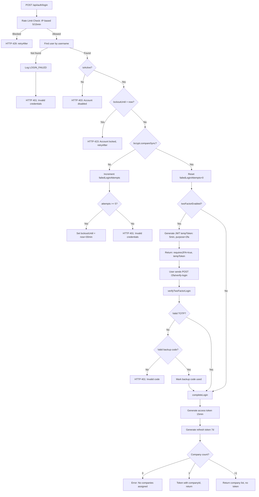
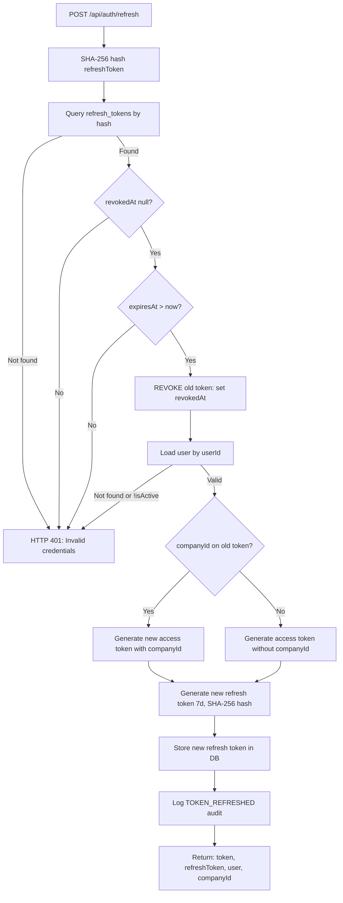
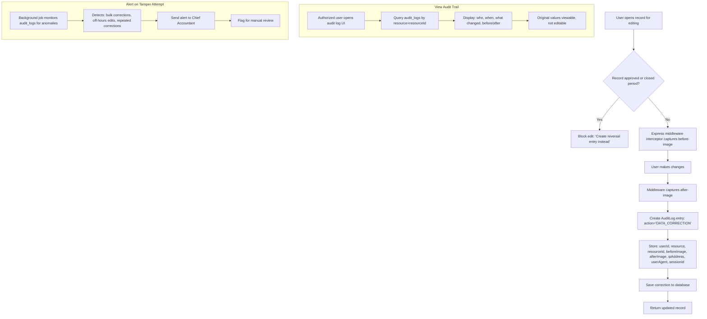
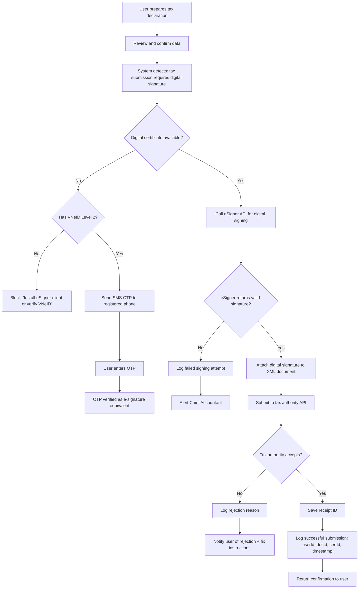

# Workflows & Processes — User Management Module

**Version:** 2.0
**Date:** 2026-07-21
**Author:** BA Lead + Chief Accountant (20+ yrs)
**Status:** Draft

---

## Workflow W-01: User Lifecycle (Create → Active → Locked → Disabled → Deleted)

```mermaid
stateDiagram-v2
    [*] --> Created: register() / adminCreate()
    Created --> Active: account created, isActive=true
    Active --> Locked: 5 failed logins within 30min
    Locked --> Active: 30min lockout expires OR password reset
    Active --> Disabled: admin sets isActive=false
    Disabled --> Active: admin reactivates
    Active --> Deleted: admin deletes user (DELETE from users)
    Locked --> Deleted: admin deletes
    Disabled --> Deleted: admin deletes
    Deleted --> [*]: record purged after retention period
    
    note right of Active: Normal operations: login, sessions, 2FA
    note right of Locked: lockoutUntil set, login blocked
    note right of Disabled: accountDisabledError on login attempt
    note left of Deleted: cascade deletes refresh_tokens, password_history, etc.
```

**Transitions:**
- `Created → Active`: Automatic on user creation (`isActive = true` default)
- `Active → Locked`: `AuthService.login()` increments `failedLoginAttempts` to 5, sets `lockoutUntil`
- `Locked → Active`: Either `Date.now() > lockoutUntil` (auto-unlock) or password reset (clears `lockoutUntil` and `failedLoginAttempts`)
- `Active → Disabled`: Admin sets `isActive = false`
- `Disabled → Active`: Admin sets `isActive = true`
- `Active/Locked/Disabled → Deleted`: Admin deletes user record (CASCADE removes `refresh_tokens`, `password_history`, `user_roles`, `user_companies`, `backup_codes`, `password_reset_tokens`)

---

## Workflow W-02: Login with Security Checks (including 2FA)



**Key source files:** `presentation/middleware/rateLimiter.ts:10-67`, `application/AuthService.ts:163-296`, `application/AuthService.ts:612-652`

---

## Workflow W-03: Token Refresh with Rotation



**Key source files:** `application/AuthService.ts:343-379`

---

## Workflow W-04: 2FA Setup and Verification Flow

```mermaid
graph TD
    subgraph Setup
        A[POST /2fa/setup] --> B[AuthService.setupTwoFactor]
        B --> C[Generate TOTP secret via OTPAuth]
        C --> D[Generate 10 backup codes: crypto.randomBytes]
        D --> E[Store secret on user: totpSecret]
        E --> F[Store SHA-256 hashed backup codes in backup_codes]
        F --> G[Return: secret (base32), backupCodes[]]
        G --> H[User scans QR or enters secret in authenticator app]
        H --> I[User generates TOTP code from app]
        I --> J[POST /2fa/verify with code]
        J --> K[AuthService.verifyAndEnableTwoFactor]
        K --> L[Create TOTP from stored secret]
        L --> M{delta !== null?}
        M -->|No| N[HTTP 400: Invalid code]
        M -->|Yes| O[Set twoFactorEnabled=true]
        O --> P[Log TWO_FACTOR_ENABLED]
        P --> Q[Return { ok: true }]
    end
    
    subgraph Login
        R[Login detects twoFactorEnabled] --> S[Return tempToken]
        S --> T[User enters code]
        T --> U[POST /2fa/verify-login]
        U --> V{Valid TOTP?}
        V -->|Yes| W[completeLogin]
        V -->|No| X{Valid backup code?}
        X -->|Yes| Y[markUsed, completeLogin]
        X -->|No| Z[HTTP 401: Invalid code]
    end
    
    subgraph Disable
        AA[POST /2fa/disable with code] --> AB[AuthService.disableTwoFactor]
        AB --> AC{Valid TOTP?}
        AC -->|No| AD[HTTP 400]
        AC -->|Yes| AE[Clear: twoFactorEnabled=false, totpSecret=undefined]
        AE --> AF[Log TWO_FACTOR_DISABLED]
        AF --> AG[Return { ok: true }]
    end
```

**Key source files:** `application/AuthService.ts:550-679`, `application/AuthService.2fa.test.ts`

---

## Workflow W-05: Company Selection Flow (Single vs Multi-Company)

```mermaid
graph TD
    A[Login] --> B[getUserCompanies: findByUserId]
    B --> C{UserCompany count?}
    
    C -->|0| D[Throw NoCompaniesAssignedError]
    
    C -->|1| E[Auto-select single company]
    E --> F[createAccessToken with companyId]
    F --> G[createRefreshToken with companyId]
    G --> H[Return: token, refreshToken, companies[{1}]]
    
    C -->|>=2| I[Return: token=null, refreshToken, companies[{n}]]
    I --> J[User selects company from list]
    J --> K[POST /select-company]
    K --> L[SHA-256 hash refreshToken]
    L --> M{Find valid?}
    M -->|No| N[HTTP 401]
    M -->|Yes| O{UserCompany active?}
    O -->|No| P[HTTP 403: not a member]
    O -->|Yes| Q[Revoke old refreshToken]
    Q --> R[Generate new access token WITH companyId]
    R --> S[Generate new refresh token WITH companyId]
    S --> T[Return: token, refreshToken, companyId, companies]
    
    subgraph Switch Company
        U[User has companyId=A in token] --> V[Want to switch to B]
        V --> W[Call selectCompany with company B's id]
        W --> X[Verify membership in B]
        X --> Y[New token for company B]
    end
```

**Key source files:** `application/AuthService.ts:254-341`, `application/AuthService.company.test.ts`

---

## Workflow W-06: Password Reset Flow

```mermaid
graph TD
    subgraph Request
        A[User clicks 'Forgot Password'] --> B[POST /forgot-password with email]
        B --> C[Find user by email]
        C -->|Not found| D[Return { ok: true, token: '' }]
        C -->|Found| E[Delete expired tokens]
        E --> F[Generate 32-byte random token]
        F --> G[SHA-256 hash token, store in password_reset_tokens]
        G --> H[1-hour expiry from now]
        H --> I[Log PASSWORD_RESET_REQUESTED]
        I --> J[Return { ok: true, token: rawToken }]
    end
    
    subgraph Reset
        K[User submits token + new password] --> L[POST /reset-password]
        L --> M[SHA-256 hash token, query password_reset_tokens]
        M -->|Not found / expired / used| N[HTTP 400: Invalid reset token]
        M -->|Valid| O[Validate new password strength]
        O -->|Weak| P[HTTP 400: Password policy message]
        O -->|Strong| Q[Hash new password: bcrypt 10 rounds]
        Q --> R[Save old hash to password_history]
        R --> S[Update user: passwordHash, failedLoginAttempts=0, lockoutUntil=null]
        S --> T[Mark token as used: usedAt=now]
        T --> U[Revoke ALL refresh tokens for user]
        U --> V[Log PASSWORD_RESET_COMPLETED]
        V --> W[Return { ok: true }]
    end
```

**Key source files:** `application/AuthService.ts:473-546`

---

## Workflow W-07: E-Tax Declaration Permission (Regulatory — NOT IMPLEMENTED)

```mermaid
graph TD
    A[Chief Accountant navigates to Tax Permissions] --> B[Display list of ke-toan-thue users]
    B --> C[Select user to authorize]
    C --> D[Select tax period]
    D --> E[Set expiry date (optional)]
    E --> F[System validates: Chief Accountant role]
    F -->|Not Chief Accountant| G[HTTP 403: Unauthorized]
    F -->|Chief Accountant| H[Check for existing authorization]
    H -->|Already authorized for period| I[Warn: duplicate]
    I --> J{Override?}
    J -->|No| K[Cancel]
    J -->|Yes| L[Revoke previous authorization]
    H -->|No existing| M[Grant tax:declare permission]
    L --> M
    M --> N[Log authorization in audit trail]
    N --> O[Tax Accountant can now file e-tax]
    
    subgraph Revocation
        P[Chief Accountant revokes permission] --> Q[Remove tax:declare role assignment]
        Q --> R[Log revocation in audit trail]
        R --> S[Tax Accountant loses e-tax access immediately]
    end
    
    subgraph Auto-Expiry
        T[Cron job checks expiry dates] --> U{Expired?}
        U -->|Yes| V[Auto-revoke permission]
        V --> W[Log auto-revocation]
    end
```

**Regulatory basis:** NĐ 23/2025/NĐ-CP, TT 19/2021/TT-BTC. **NOT implemented in current codebase.**

---

## Workflow W-08: Data Correction with Audit Trail (Regulatory — NOT IMPLEMENTED)



**Regulatory basis:** TT 99/2025/TT-BTC Điều 28, Luật Kế toán 88/2015/QH13 Điều 26. **NOT implemented in current codebase.**

---

## Workflow W-09: Digital Signature for Tax Filing (Regulatory — NOT IMPLEMENTED)



**Regulatory basis:** NĐ 23/2025/NĐ-CP (Electronic signatures), NĐ 69/2024/NĐ-CP (VNeID). **NOT implemented in current codebase.**

---

## Workflow Summary

| W-ID | Name | Implemented | Regulatory | Priority |
|---|---|---|---|---|
| W-01 | User Lifecycle | YES | — | HIGH |
| W-02 | Login with Security Checks | YES (+2FA) | Implicit | HIGH |
| W-03 | Token Refresh with Rotation | YES | — | HIGH |
| W-04 | 2FA Setup and Verification | YES | Security best practice | HIGH |
| W-05 | Company Selection | YES | Multi-tenant | HIGH |
| W-06 | Password Reset | YES | — | HIGH |
| W-07 | E-Tax Declaration Permission | NO | NĐ 23/2025 | CRITICAL |
| W-08 | Data Correction with Audit Trail | NO | TT 99/2025 Điều 28 | CRITICAL |
| W-09 | Digital Signature for Tax Filing | NO | NĐ 23/2025, NĐ 69/2024 | CRITICAL |
