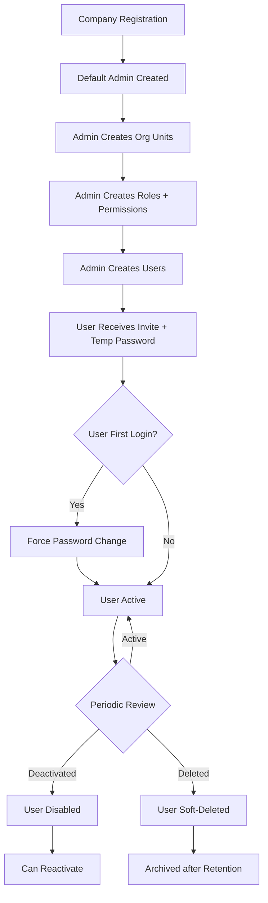
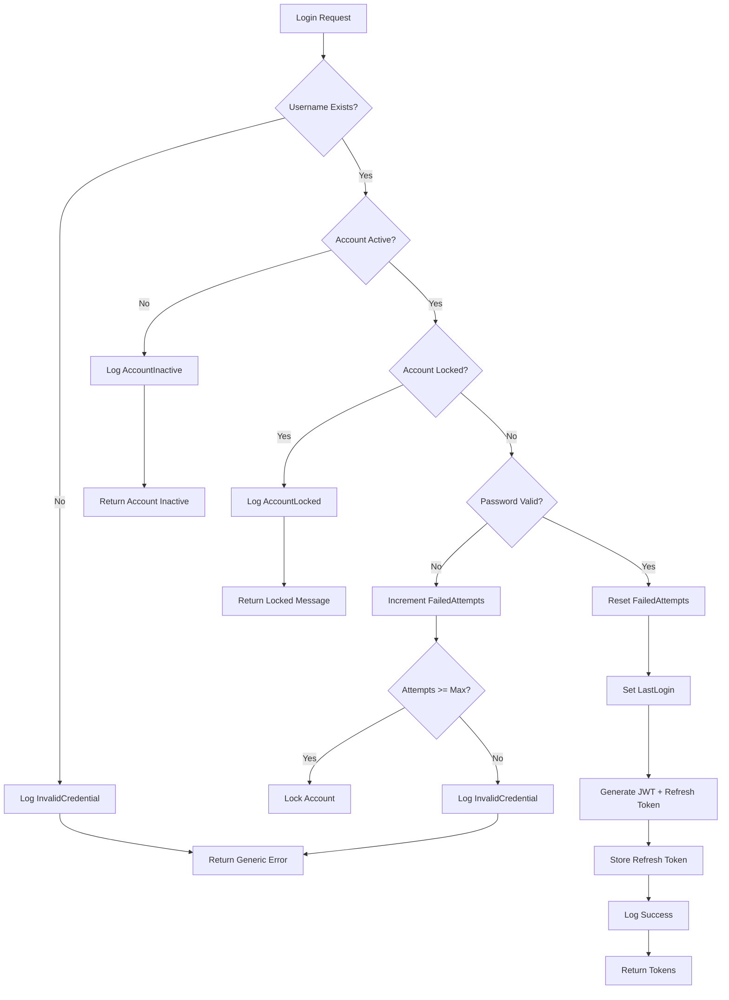
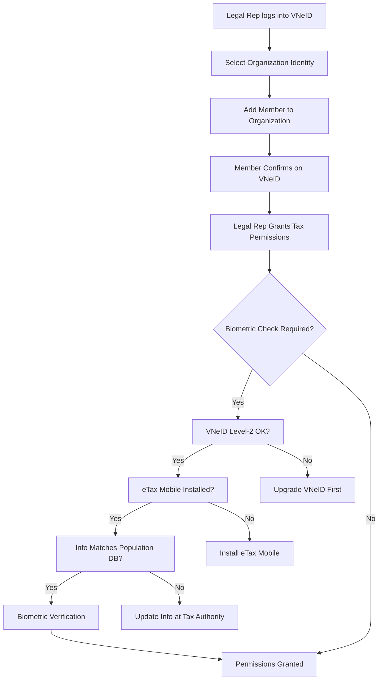
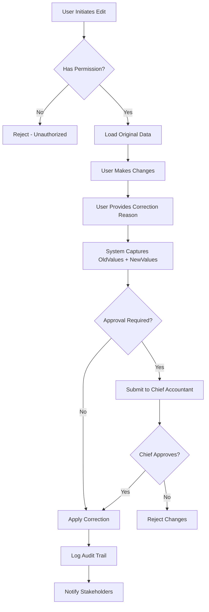
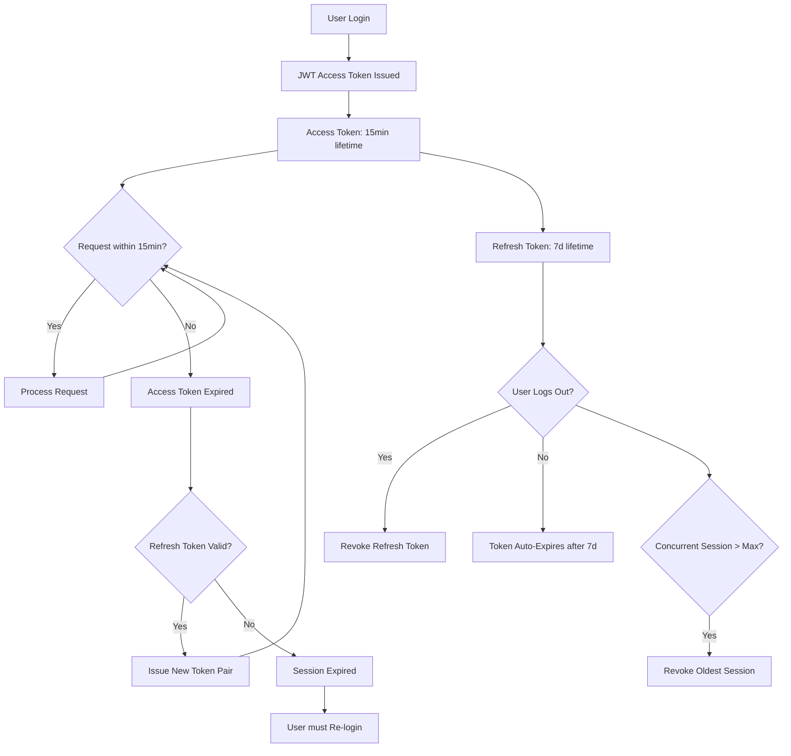

# Workflows & Processes — User Management

---

## Workflow W-01: User Lifecycle



## Workflow W-02: Login with Security Checks



## Workflow W-03: E-Tax Declaration Permission (Regulatory)



## Workflow W-04: Data Correction with Audit Trail (Regulatory Requirement)



## Workflow W-05: User Session Lifecycle



## Workflow W-06: User Registration for Accounting Role

```
Step 1: Company admin identifies need for new user
Step 2: Admin determines user role (based on accounting org structure)
        - Kế toán trưởng (Chief Accountant)
        - Kế toán tổng hợp (General Accountant)
        - Kế toán thuế (Tax Accountant)
        - Kế toán công nợ (Payables/Receivables)
        - Kế toán kho (Inventory Accountant)
        - Kế toán tiền lương (Payroll Accountant)
        - Thủ quỹ (Cashier)
        - Kế toán viên (Staff Accountant)
Step 3: Admin assigns Organization Unit (Phòng Kế toán / chi nhánh)
Step 4: Admin assigns Feature Permissions based on role
        - View: Can view reports
        - Create: Can create journal entries, invoices
        - Edit: Can edit unposted entries
        - Delete: Can delete unapproved entries
        - Print: Can print books, reports
        - Export: Can export data
        - Approve: Can approve entries (Chief Accountant only)
Step 5: Account created, user notified
Step 6: User logs in, changes temp password
Step 7: User begins work with assigned permissions
```

## Process P-01: Regulatory Compliance Check

```
TRIGGER: Monthly / Quarterly / Annual

1. LOAD applicable regulations list
   - Luật Kế toán 88/2015/QH13 (as amended)
   - TT 99/2025/TT-BTC or TT 133/2016/TT-BTC (per company choice)
   - NĐ 254/2026/NĐ-CP (e-invoices)
   - Tax laws per current period

2. VERIFY user permissions matrix
   - All users have appropriate access for role
   - No unauthorized approvers
   - Chief Accountant has approve-only rights on critical records

3. VERIFY audit trail completeness
   - All corrections have trail
   - No silent deletions
   - All modifications traceable to user + timestamp + IP

4. VERIFY system logs
   - Login attempts (success + failure)
   - Permission changes
   - Configuration changes

5. GENERATE compliance report

6. FLAG violations to Chief Accountant + Legal Rep

OUTPUT: Compliance Report
```

## Process P-02: User Deactivation (Employee Departure)

```
TRIGGER: Employee resignation / termination

1. Admin receives departure notification
2. Admin disables user account (IsActive = false)
3. System invalidates all active refresh tokens
4. System logs deactivation with reason + timestamp
5. System reassignes pending approval tasks to delegate
6. Audit log records which admin performed deactivation
7. User data retained per retention policy (5 years per Luật Kế toán)

RULES:
- Cannot delete user with audit trail (must soft-delete)
- User's historical transactions must remain attributable
- Re-activation requires Chief Accountant approval
```
