# Workflows — Company Module

> **Domain:** Doanh nghiệp (Enterprise)
> **Module:** Company Administration
> **Regulatory basis:** Luật Doanh nghiệp 2020, NĐ 168/2025/NĐ-CP, TT 99/2025/TT-BTC, NĐ 69/2024/NĐ-CP, NĐ 23/2025/NĐ-CP, Luật Kế toán 88/2015

---

## WF-01: Company Registration Lifecycle

**Actors:** System Admin (SA), Company Admin (CA), Tax Authority Integration (TAX), Chief Accountant (KT)

**Trigger:** Business requirement to onboard a new enterprise onto the accounting platform

**Preconditions:**
1. SA has permission `Company.Create`
2. TaxCode not already registered in system (unique constraint)
3. SA has valid business registration certificate data for the company
4. Internet connectivity for tax authority MST lookup (optional)

**Postconditions:**
1. Company entity created with status Active
2. CompanySettings created with VND defaults per TT 99/2025
3. CompanySettings.AccountingRegime set (TT99 or TT133)
4. At least one LegalRepresentative on record
5. At least one BusinessLine with VSIC code
6. Company associated with SA as first UserCompany record
7. Tax authority notified of new company registration
8. Audit log: `CompanyCreated`

### Swimlane Flow

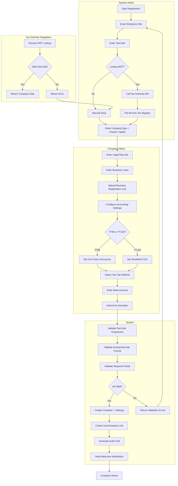

### Detailed Steps

| Step | Actor | Action | System Response | Validation | Error Handling |
|------|-------|--------|-----------------|------------|----------------|
| 1 | SA | Navigate to Admin → Companies → Create New | Display empty registration form | Permission check `Company.Create` | 403 if unauthorized |
| 2 | SA | Enter company identity info: NameVietnamese, NameEnglish, AbbreviatedName, EnterpriseCode, TaxCode, HeadOfficeAddress, Province/District/Ward | Validate fields as typed | NameVietnamese: required, max 400 chars, VN alphabet per Điều 37. EnterpriseCode: `^\d{10}$`. TaxCode: `^\d{10}(-\d{3})?$` per TT 105/2020 | Inline validation errors per field |
| 3 | SA | Optionally click "Lookup MST" to auto-fill from tax registry | Call TAX API (Tổng cục Thuế MST lookup) with TaxCode | API response maps: TaxCode → Name, Address, LegalRep, Status | API timeout → fallback to manual entry. API returns error → show error + manual entry |
| 4 | SA | Select CompanyType from enum dropdown | Filter subsequent forms by type | Required. LLC1/2/JSC/DNTN/CTHD/etc. JSC requires min 3 shareholders | — |
| 5 | SA | Enter CharterCapital (vốn điều lệ) and establish date | Show capital fields | CharterCapital >= 0 decimal(18,2). DateOfEstablishment in past. Regulated industries: check legal capital minimums | — |
| 6 | CA | Add LegalRepresentative info: FullName, VNeIDNumber (CCCD), Position, IsPrimary | Validate and store | VNeIDNumber: exactly 12 digits for new CCCD, 9 for old CMND. At least 1 rep required, exactly 1 primary | Duplicate CCCD → "already registered for this company" |
| 7 | CA | Add BusinessLine(s) with VSIC code via search | Show VSIC hierarchy browser | At least 1 primary business line required. VSIC code must exist in classification. Conditional lines flagged | Invalid VSIC → "select from code list" |
| 8 | CA | Upload Business Registration Certificate (PDF/JPEG) | Store to blob storage, run OCR | Max 10MB, PDF/JPEG/PNG. OCR extracts TaxCode + Name → compare to entered data | OCR mismatch → warning + manual verify. File too large → reject |
| 9 | CA | Configure CompanySettings: AccountingRegime, FiscalYearStartMonth, CurrencyCode, DecimalPlaces, TaxCalculationMethod, InventoryMethod | Show defaults | TT99 or TT133. FiscalYearStartMonth 1-12. DecimalPlaces default 0 per TT 99 Điều 8. TaxCalcMethod: KhauTru/TrucTiep | Settings locked after first period close |
| 10 | CA | Enter BankAccount: AccountNumber, BankName, Branch, IsPrimaryTaxPayment | Validate | AccountNumber 8-20 digits. BankName must be from SBV-licensed list. At least 1 account required. Exactly 1 primary tax payment account | Invalid bank → warning + flag |
| 11 | CA | Click "Submit & Activate" | Final validation | All required fields: EnterpriseCode, TaxCode, Name, CompanyType, 1 LegalRep, 1 BusinessLine, 1 BankAccount, Settings complete | Return list of all missing fields |
| 12 | System | — | Create Company + Settings + LegalReps + BusinessLines + BankAccount in transaction | TaxCode unique across DB. EnterpriseCode unique. All FK constraints | Transaction rollback on any failure. Log partial state |
| 13 | System | — | Create UserCompany record (SA as first member) | UserCompany.IsActive = true. SA role = Admin | — |
| 14 | System | — | Log `CompanyCreated` audit event with all initial values | OldValues = null, NewValues = full snapshot | — |
| 15 | System | — | Send welcome notification to SA | Email or in-app: "Company [Name] registered successfully" | Notification failure non-blocking |

### Timing Constraints

| Step | Constraint |
|------|-----------|
| Step 3 (MST lookup) | API timeout after 10s. Max 3 retries with 5s backoff |
| Step 8 (OCR) | OCR must complete within 30s. Fall back to manual verify on timeout |
| Step 12 (Transaction) | DB transaction timeout: 60s |
| Overall form | Session timeout: 30min inactivity. Draft saved automatically at 25min |

### Integration Points

| Module | Integration |
|--------|------------|
| Tax Declaration | Company.TaxCode, TaxOfficeId used as root for all tax filings |
| GL / Chart of Accounts | CompanySettings.AccountingRegime drives COA template selection (TT99 vs TT133) |
| HR / Payroll | Company.Branches used for department/org structure in payroll |
| Document Management | BusinessRegCert stored as CompanyDocument, referenced by licenses |
| VNeID | Company.LegalRepresentative.VNeIDNumber used for VNeID registration (WF-07) |
| Audit | Every entity create/update logged in AuditTrail with CompanyId scope |
| Notification | Welcome email sent; compliance reminders scheduled |

---

## WF-02: Company Information Change

**Actors:** Company Admin (CA), Chief Accountant (KT), System (SYS), National Business Registry Portal (NBR)

**Trigger:** User edits company profile fields (name, address, contact info, charter capital)

**Preconditions:**
1. User has permission `Company.Update`
2. Company status = Active or Suspended
3. TaxCode change requires additional permission `Company.UpdateTaxCode`
4. EnterpriseCode change NOT permitted (immutable per NĐ 168/2025 Điều 31)

**Postconditions:**
1. Company record updated with new values
2. Former name preserved in FormerNames list (if name changed)
3. Audit trail entry with old/new values and mandatory reason
4. If material change: notification flag set for public disclosure within 10 days (NĐ 168 Điều 35)
5. Re-validation triggered if settings changed mid-year

### Swimlane Flow

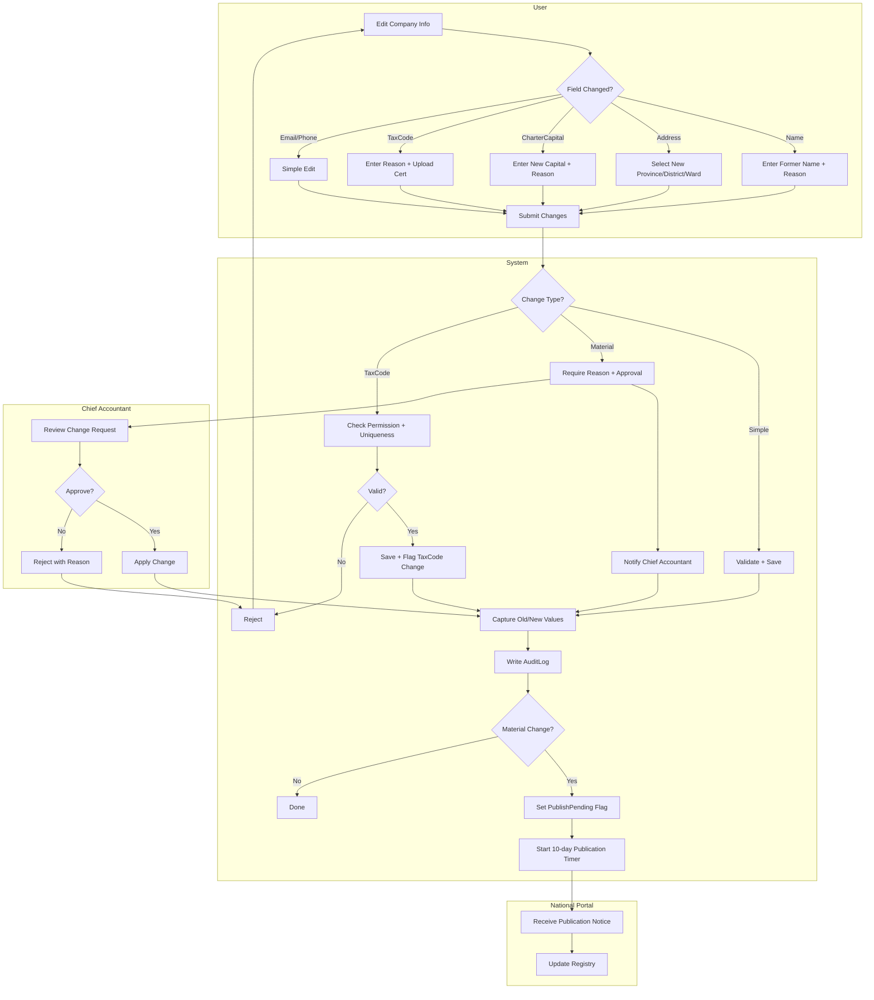

### Detailed Steps

| # | Actor | Action | System Response | Validation | Error Handling |
|---|-------|--------|-----------------|------------|----------------|
| 1 | User | Navigate to Admin → Company → Info tab | Load current values into editable form | Permission check `Company.Update` | 403 if unauthorized |
| 2 | User | Modify one or more fields | Live validation as user types | See field-specific rules below | Inline error messages |
| 3 | User | If NameVietnamese changed: enter previous name (auto-captured as FormerName) | Display FormerName dialog | Name format per Điều 37-38 (VN alphabet, no prohibited terms). FormerName.FromDate = current date, ToDate = null | Name similar to prohibited terms → reject |
| 4 | User | If CharterCapital changed: enter new amount + reason | Validate minimums per company type | CharterCapital >= 0. If regulated industry: check pháp định minimum. Reason: max 500 chars, required | Below minimum → reject with reference to legal minimum |
| 5 | User | If TaxCode changed: enter reason + upload supporting certificate | Check `Company.UpdateTaxCode` permission | TaxCode format `^\d{10}(-\d{3})?$`. Unique across DB. Reason required. Certificate required | No permission → "Contact admin". Duplicate → "already registered". No reason → required field |
| 6 | User | Click "Save Changes" | Submit for processing | All field validations pass | Aggregate validation errors displayed |
| 7 | System | Classify change severity | — | Simple = email/phone/website. Material = name/address/capital/legal rep. Critical = TaxCode | — |
| 8 | System | If material: route to Chief Accountant approval | Create approval request notification | KT must have role `ChiefAccountant` | If no KT configured → fallback to SA |
| 9 | KT | Approve or reject with reason | (see WF-02 approval step) | Approval must include digital signature per NĐ 23/2025 if TaxCode change | Rejection returns user to edit form with KT's reason |
| 10 | System | Apply changes: update Company record, capture old/new values | DB update within transaction | All FK constraints, no concurrent edit conflict | Optimistic concurrency: if another edit happened → reload + retry |
| 11 | System | Write AuditLog entry | EntityType=Company, OldValues=JSON, NewValues=JSON, Reason, ChangedBy, ChangedAt | OldValues always captured before write | If audit write fails → rollback entire change |
| 12 | System | If name changed: create FormerName record | FormerName.Name = old name, FromDate = now | Preserve all previous names. FormerName list grows monotonically | — |
| 13 | System | If material change: set PublishPending=true, start 10-day timer | Trigger background job: Day 9 → reminder. Day 10 → escalate to SA | NĐ 168/2025 Điều 35: public notification within 10 days | Timer expired without publish → escalate to Legal Rep |
| 14 | System | If TaxCode changed: notify Tax Declaration module | Flag: "Pending re-validation of existing tax declarations" | — | — |

### Field-Specific Validation Rules

| Field | Required? | Format | Permissions | Audit Level |
|-------|-----------|--------|-------------|-------------|
| NameVietnamese | Yes | VN alphabet + F/J/Z/W + digits + .,-+ max 400 | Company.Update | Material |
| NameEnglish | No | Unicode + digits + .,-+ max 400 | Company.Update | Material |
| AbbreviatedName | No | Max 100 | Company.Update | Simple |
| HeadOfficeAddress | Yes | Max 500 | Company.Update | Material |
| Province/District/Ward | Yes | From admin hierarchy lookup | Company.Update | Material |
| Phone | No | Viettel/VNPT/Mobifone patterns, 10-11 digits | Company.Update | Simple |
| Email | No | Standard email format | Company.Update | Simple |
| Website | No | URL format | Company.Update | Simple |
| CharterCapital | Yes | decimal(18,2) >= 0 | Company.Update + KT approval | Material |
| TaxCode | No (locked after creation) | `^\d{10}(-\d{3})?$` | Company.UpdateTaxCode (special) | Critical |
| EnterpriseCode | Immutable | `^\d{10}$` | — (cannot change per NĐ 168 Điều 31) | N/A |

### Timing Constraints

| Condition | Constraint |
|-----------|-----------|
| Material change publication | Within 10 calendar days per NĐ 168/2025 Điều 35 |
| KT approval timeout | 3 working days. Escalate to SA on day 4 |
| TaxCode change re-validation | Tax declarations filed in last 12 months flagged for review |
| Audit log retention | Minimum 5 years per Luật Kế toán 88/2015 Điều 41 |

### Error Handling Matrix

| Error | Detection Point | Response | Recovery |
|-------|----------------|----------|----------|
| Concurrent edit conflict | Save (Step 10) | "Company info changed by another user. Reload and retry." | Reload current DB values, re-apply edits |
| TaxCode already exists | Step 5 validation | "TaxCode already registered to another company" | User enters different TaxCode or verifies existing |
| KT approval timeout | Step 9, Day 4 | Escalate to SA with full change context | SA can approve/reject as proxy |
| Publication timer expired | Background job Day 10+ | "Public notification overdue. Publish now." + Legal Rep alerted | User completes portal submission |
| Audit DB unavailable | Step 11 | Transaction rollback, system alert | Retry with exponential backoff max 3x |

### Integration Points

| Module | Integration |
|--------|------------|
| GL/Accounting Periods | Capital change → re-check pháp định thresholds. Name change → update printed report headers |
| Tax Declaration | TaxCode change → flag all open declarations for re-validation. Address change → update tax filing address |
| Inventory | InventoryMethod change blocked mid-year per VAS 02 (validated in system) |
| E-Invoice | Company name/address/taxcode change → update e-invoice template + notify e-invoice provider |
| National Business Portal | Material change must be published within 10 days → integration for automated publish |
| Audit | All changes logged with before/after values, reason, and user identity |

---

## WF-03: Company Status Change

**Actors:** Company Admin (CA), Chief Accountant (KT), System (SYS)

**Trigger:** Business decision to change company operational status (suspend, resume, dissolve)

**Preconditions:**
1. User has permission `Company.ChangeStatus`
2. Company exists
3. Valid state transition per state machine
4. No pending tax declarations (for suspension/dissolution)

**Postconditions:**
1. Company.Status updated with effective date
2. CompanyStatusLog entry created with reason
3. Feature access gated per new status (read-only, restricted, full)
4. If Suspended: all financial operations blocked
5. If Dissolved: company set to read-only, data archived
6. Notifications sent to all assigned users
7. Audit log: `CompanyStatusChanged`

### Status State Machine

```
                        ┌─────────────────┐
                        │     Pending      │
                        │  (Chờ kích hoạt) │
                        └────────┬─────────┘
                                 │ Activate
                                 ▼
┌───────────────────────────────────────────────────────┐
│                      Active                            │
│                  (Đang hoạt động)                      │
│                                                        │
│  Financial operations: FULL                            │
│  Tax filing: FULL                                      │
│  User management: FULL                                 │
└──┬──────────────┬──────────────────┬───────────────────┘
   │ Suspend      │ Resume           │ Dissolve
   ▼              │                  ▼
┌──────────┐      │           ┌──────────────┐
│Suspended │──────┘           │  Dissolving   │
│(Tạm      │                  │ (Đang giải    │
│ ngừng)   │                  │  thể)         │
└──────────┘                  └──────┬────────┘
   │ Financial: READ-ONLY (except     │ Complete
   │   tax filing + payments)         ▼
   │ Tax: FULL                   ┌──────────────┐
   │ User mgmt: LIMITED         │  Dissolved    │
   │                              │  (Đã giải     │
   │                              │   thể)        │
   │                              └──────────────┘
   │                              │ Financial: NONE
   │                              │ Tax: NONE
   │                              │ User mgmt: NONE
   │                              │ Data: READ-ONLY
   ▼
┌──────────┐
│ Bankrupt  │
│ (Phá sản) │
└──────────┘
   │ Financial: NONE
   │ Data: READ-ONLY
   │ (terminal state)
```

### Workflow

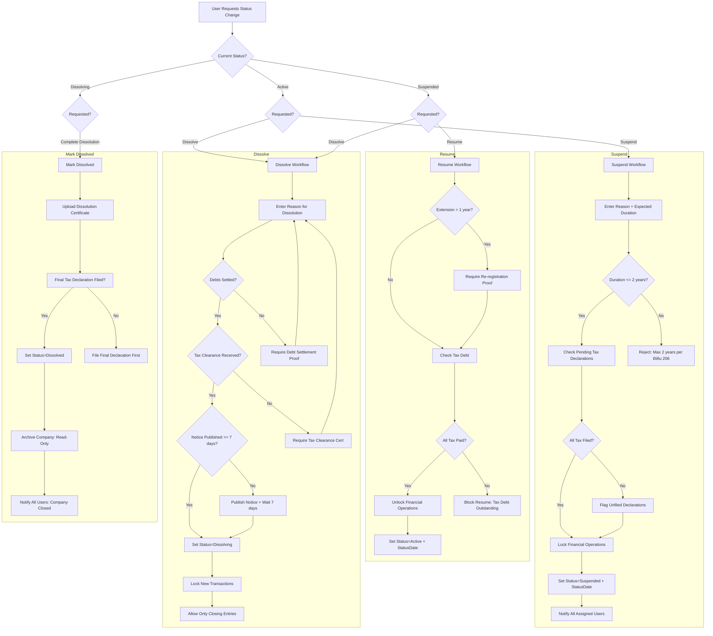

### Detailed Steps: Suspend

| # | Actor | Action | Validation | Error Handling |
|---|-------|--------|------------|----------------|
| 1 | CA | Navigate to Admin → Company → Status tab | Permission `Company.ChangeStatus` | 403 if unauthorized |
| 2 | CA | Select "Temporarily Suspend" | Transition Active→Suspended allowed | Invalid transition → reject with message |
| 3 | CA | Enter reason (required): "Lý do tạm ngừng" | Max 1000 chars | Required field validation |
| 4 | CA | Enter expected resume date | Must be <= 2 years from today per Điều 206 | Exceeds limit → "Max suspension 2 years. One-time extension to 3 years available." |
| 5 | System | Check pending tax declarations | Query TaxDeclaration where status != Filed AND companyId = current | If unfiled → flag as warning (non-blocking) |
| 6 | System | Lock financial operations: block new JE, invoices, payments, purchases | Set feature gates per Suspended rules | — |
| 7 | System | Set Company.Status = Suspended, Company.StatusDate = now | Write CompanyStatusLog with from/to/reason | DB write failure → retry 3x |
| 8 | System | Notify all assigned users | System notification + email: "[CompanyName] suspended effective [date]" | Notification failure → logged, non-blocking |

### Detailed Steps: Resume

| # | Actor | Action | Validation | Error Handling |
|---|-------|--------|------------|----------------|
| 1 | CA | Navigate to Status tab on suspended company | Transition Suspended→Active allowed | — |
| 2 | CA | Click "Resume Operations" | — | — |
| 3 | System | If suspension > 1 year: require re-registration proof document | Document Uploaded flag = true | Block resume: "Upload re-registration certificate first" |
| 4 | System | Check outstanding tax debt | Query TaxDebt where companyId = current AND balance > 0 | Block resume: "Outstanding tax debt must be cleared. Current balance: [amount]" |
| 5 | System | Unlock financial operations | Remove feature gates | — |
| 6 | System | Set Status = Active, StatusDate = now | Log status change | — |

### Detailed Steps: Dissolve

| # | Actor | Action | Validation | Error Handling |
|---|-------|--------|------------|----------------|
| 1 | CA | Select "Begin Dissolution" | Transition Active→Dissolving or Suspended→Dissolving | Block if invalid transition |
| 2 | CA | Enter reason (required) | Max 1000 chars, must match dissolution grounds per Điều 207 | Required field |
| 3 | System | Verify debts settled (user declaration) | Checkbox + document upload | Cannot proceed without confirmation |
| 4 | System | Verify tax clearance certificate on file | CompanyDocument where DocumentType=TaxClearanceCert | Block: "Upload tax clearance certificate from tax authority" |
| 5 | System | Verify dissolution notice published >= 7 days prior | NoticePublishedDate field | Block: "Notice must be published on National Portal for at least 7 days. Publish now." |
| 6 | System | Set Status = Dissolving | — | — |
| 7 | System | Lock new transactions: JE, invoices, purchases, bank | Feature gate | — |
| 8 | System | Allow only: closing entries, tax finalization, report viewing | Feature gate | — |

### Detailed Steps: Mark Dissolved

| # | Actor | Action | Validation | Error Handling |
|---|-------|--------|------------|----------------|
| 1 | SA/Admin | Upload Dissolution Certificate (Giấy chứng nhận giải thể) | PDF/JPEG, max 10MB. OCR extracts certificate number | Upload failure → retry |
| 2 | System | Verify final tax declaration filed | Query TaxDeclaration where Period = current AND Type = Final | Block: "Final tax declaration must be filed before marking dissolved" |
| 3 | System | Set Status = Dissolved, StatusDate = now | Log final status | — |
| 4 | System | Set company to read-only | All write operations gated across all modules | — |
| 5 | System | Notify all users: "Company [Name] has been dissolved. All data preserved for 5-year retention period." | Email + in-app | — |

### Timing Constraints

| Condition | Constraint |
|-----------|------------|
| Suspension max duration | 2 consecutive years (one-time extension to 3 years per Điều 206) |
| Suspension -> forced dissolution | After max suspension period + no extension → system auto-flags for dissolution |
| Dissolution notice period | Minimum 7 days published on National Portal per NĐ 01/2021 Điều 75 |
| Tax clearance certificate | Must be issued within 30 days of request per Luật QLT 38/2019 Điều 66 |
| Post-dissolution data retention | Minimum 5 years per Luật Kế toán 88/2015 Điều 41 |

### Error Handling Matrix

| Error | Detection | Response |
|-------|-----------|----------|
| Invalid state transition | Step 2 check | "Transition [X]→[Y] not permitted per state machine" |
| Pending tax declarations | Suspend Step 5 | Warning banner but non-blocking; user can proceed |
| Tax debt outstanding | Resume Step 4 | Block + display debt amount + link to tax module |
| Missing dissolution certificate | Mark Dissolved Step 1 | Block + "Upload dissolution certificate" |
| Final tax not filed | Mark Dissolved Step 2 | Block + redirect to Tax Declaration module |
| Concurrent status change (race) | All save steps | Concurrency token check; reject + reload status |

### Integration Points

| Module | Integration |
|--------|------------|
| GL / Journal Entry | Status=Suspended/Dissolving: block new JE creation. Dissolved: read-only. Show status reason in error |
| Tax Declaration | Suspended: allow tax filing only. Dissolving: require final tax declaration. Dissolved: no tax ops |
| E-Invoice | Suspended: block new e-invoices. Dissolving: allow closing invoices only |
| Payment / Banking | Suspended: block new payments except tax payments. Dissolving: allow payments for closure only |
| User Management | Suspended: can manage users. Dissolving: limited. Dissolved: no user management |
| Report | All statuses: allow report viewing. Dissolved: reports read-only with "Archived" watermark |
| Audit | Every status change logged with from/to status, reason, timestamp, user |

---

## WF-04: Fiscal Year Setup and Change

**Actors:** Chief Accountant (KT), System Admin (SA), System (SYS)

**Trigger:** Initial company setup (fiscal year declaration) OR mid-year change request

**Preconditions:**
1. User has permission `Company.UpdateSettings`
2. Company exists
3. For change: no journal entries posted in current fiscal year (if changing start month)
4. For change: Chief Accountant approval required (BR-OP-02)

**Postconditions:**
1. CompanySettings.FiscalYearStartMonth updated
2. Accounting periods regenerated (if no transactions exist)
3. If mid-year change: old periods archived, new periods created
4. Audit log: `FiscalYearChanged` with before/after
5. TT 99/2025 declaration updated in system

### Workflow

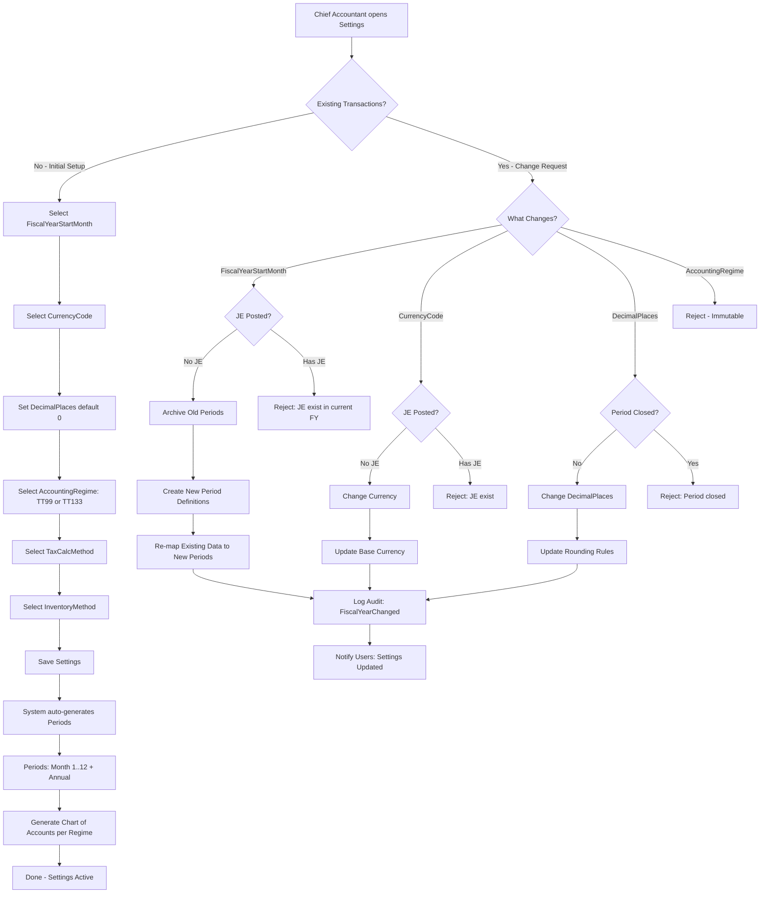

### Detailed Steps: Initial Setup

| # | Actor | Action | Validation | Error |
|---|-------|--------|------------|-------|
| 1 | KT | Navigate to Admin → Company → Settings | Permission `Company.UpdateSettings` | 403 |
| 2 | KT | Select FiscalYearStartMonth (1-12) | 1 <= month <= 12. Default 1 (calendar year per Luật Kế toán Điều 12) | Out of range → reject |
| 3 | KT | Select CurrencyCode | Default "VND". Multi-currency toggle available | Non-VND + single mode → reject |
| 4 | KT | Set DecimalPlaces per TT 99/2025 Điều 8 | 0-6. Default 0 (VND is integer currency) | Out of range → clamp |
| 5 | KT | Select AccountingRegime: TT99 or TT133 | Required. Drives COA template. Cannot change later | No selection → required |
| 6 | KT | Select TaxCalculationMethod: KhauTru / TrucTiep / HonHop | Required. Must match tax authority registration | Mismatch with tax authority → warning |
| 7 | KT | Select InventoryMethod: FIFO / BinhQuan / ThucTe / NhapTruocXuatSau | Required for inventory-enabled companies | — |
| 8 | KT | Click Save | All validations pass | Aggregate error display |
| 9 | SYS | Auto-generate period definitions | 12 monthly periods + 1 annual period. Period.FromDate, Period.ToDate, Period.Year | Generation failure → retry |
| 10 | SYS | Generate Chart of Accounts from regime template | TT99: full COA (~200 accounts). TT133: simplified (~120 accounts) | — |
| 11 | SYS | Log `CompanySettingsCreated` with full settings snapshot | — | — |

### Detailed Steps: Mid-Year Change

| # | Actor | Action | Validation | Error |
|---|-------|--------|------------|-------|
| 1 | KT | Attempt to change FiscalYearStartMonth | Detect existing period definitions | — |
| 2 | SYS | Check if any JE posted in current FY | Query JournalEntry where FiscalYear = CurrentYear | If exists → block: "Cannot change fiscal year after transactions posted" |
| 3 | SYS | Check if any period closed | Query Period where IsClosed = true AND Year = CurrentYear | If closed → block: "Cannot change fiscal year after period closed" |
| 4 | SYS | Archive current period definitions | Set Period.IsArchived = true for all current year periods | Archive failure → rollback |
| 5 | SYS | Create new period definitions based on new start month | Calculate 12 new periods from new start month | Generation failure → rollback, restore archived periods |
| 6 | SYS | Re-map existing data (if any): adjust period references | Update JournalEntry.PeriodId where applicable | Data mismatch → manual review flag |
| 7 | SYS | Log `FiscalYearChanged` with before/after start month, reason | OldValue = 1, NewValue = 4, Reason = "Changed to match tax year" | — |
| 8 | SYS | Notify all users: "Fiscal year start month changed to [month]" | — | — |

### Decimal Places Change Guard

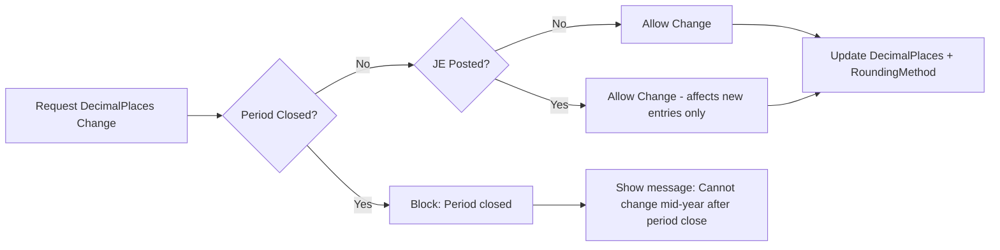

### Timing Constraints

| Condition | Constraint |
|-----------|------------|
| Fiscal year start month | Cannot change after JE posted in current fiscal year |
| Decimal places | Cannot change after first period close |
| AccountingRegime | Immutable after any transactions exist (BR-OP-02) |
| CurrencyCode | Can change only with 0 JE in current fiscal year |
| InventoryMethod | Cannot change mid-fiscal-year per VAS 02 |
| TaxCalculationMethod | Can change only at start of fiscal year per TT 99 Điều 12 |

### Error Handling Matrix

| Error | Detection | Response |
|-------|-----------|----------|
| JE exist in current FY | Check Step 2 | "Cannot change fiscal year: [N] journal entries have been posted in the current fiscal year" |
| Period already closed | Check Step 3 | "Cannot change: Period [Month/Year] is already closed. Rollback period close first." |
| Period archive failure | Step 4 | Rollback entire operation. "Failed to archive existing periods. Contact support." |
| Data re-map inconsistency | Step 6 | "Some existing records could not be re-mapped. [N] items flagged for manual review." |
| Concurrent settings edit | Save step | Optimistic concurrency: "Settings changed by another user. Reload and retry." |

### Integration Points

| Module | Integration |
|--------|------------|
| GL | Fiscal year drives period definitions. Period.IsClosed flag gates JE creation. COA template from regime selection |
| Tax Declaration | Period.FromDate/ToDate used for tax period calculation. TT99 vs TT133 determines tax report format |
| Inventory | InventoryMethod affects cost calculation algorithms used in GL |
| Multi-Currency | CurrencyCode + DecimalPlaces + RoundingMethod affect exchange rate calculations (VAS 10) |
| Report | Fiscal year determines comparative periods in financial statements (BCĐKT, BCKQKD) |
| Audit | All settings changes logged with before/after values, KT identity, timestamp |

---

## WF-05: Multi-Company User Workflow

**Actors:** User (USR), System (SYS), Company Admin (CA)

**Trigger:** User assigned to multiple companies needs to switch context OR admin assigns user to additional company

**Preconditions:**
1. User has at least one active UserCompany relationship
2. For switch: user assigned to >= 2 companies
3. For assignment: CA has permission `Company.AssignUser`

**Postconditions:**
1. User's active company context updated in session
2. UI reloads with new company data (COA, settings, tax info)
3. All subsequent queries scoped to active CompanyId
4. Audit log: `UserSwitchedCompany` or `UserAssignedToCompany`

### Data Isolation Model

```
┌─────────────────────────────────────────────────┐
│                 Application Session              │
│                                                   │
│  HttpContext.Items["CurrentCompanyId"] = Guid     │
│  HttpContext.Items["CurrentCompanyName"]          │
│  HttpContext.Items["UserId"] = string              │
└──────────────────────┬──────────────────────────┘
                       │
                       ▼
        ┌──────────────────────────────┐
        │   Tenant Filter Interceptor  │
        │   (applied on all scoped     │
        │    DbSet queries)            │
        │                              │
        │  .Where(x => x.CompanyId     │
        │    == currentCompanyId)       │
        └──────────────────────────────┘
                       │
                       ▼
        ┌──────────────────────────────┐
        │   Tenant-Scoped Tables       │
        │                              │
        │  JournalEntry                │
        │  Invoice                     │
        │  ChartOfAccount              │
        │  FixedAsset                  │
        │  ... (all with CompanyId FK) │
        └──────────────────────────────┘
```

### Workflow

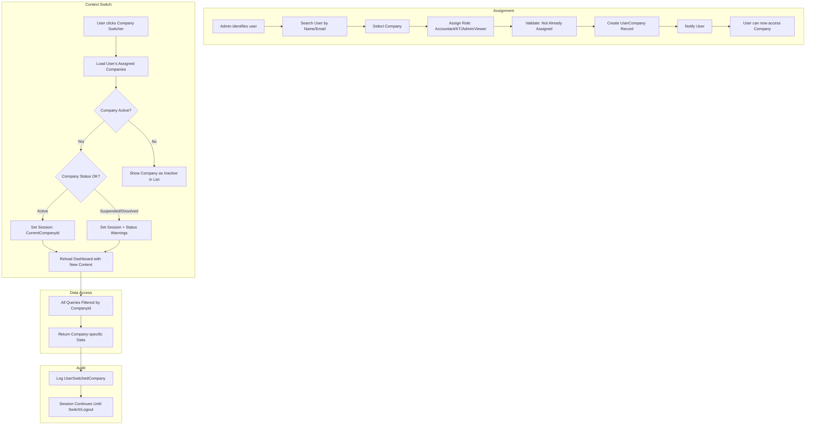

### Detailed Steps: User Assignment

| # | Actor | Action | Validation | Error |
|---|-------|--------|------------|-------|
| 1 | CA | Navigate to Company → Users tab | Permission `Company.AssignUser` | 403 |
| 2 | CA | Search user by name/email/username | User must exist and be active | "User not found" |
| 3 | CA | Select company from dropdown | Default = current active company | — |
| 4 | CA | Select role: Accountant / Chief Accountant / Admin / Viewer | Role assigned from permission matrix | — |
| 5 | CA | Click "Assign" | Check UserCompany not already exists with IsActive=true | "User already assigned to this company" |
| 6 | SYS | Create UserCompany record | UserId + CompanyId unique constraint | Duplicate → rollback |
| 7 | SYS | Send notification: "You have been assigned to [CompanyName] as [Role]" | Email + in-app notification | Notification failure → non-blocking |

### Detailed Steps: Context Switch

| # | Actor | Action | Validation | Error |
|---|-------|--------|------------|-------|
| 1 | USR | Click company switcher in header (shows current company name) | User is authenticated | — |
| 2 | SYS | Load UserCompany list where IsActive=true | Query from DB with user's Id | Empty list → "No active companies" + redirect to setup |
| 3 | SYS | Display scrollable dropdown: CompanyName + TaxCode + Status badge | Max 50 items; search filter if more | — |
| 4 | USR | Select target company | — | — |
| 5 | SYS | Validate UserCompany still active (concurrent deactivation check) | UserCompany.IsActive == true | "Access revoked" → refresh list |
| 6 | SYS | Update session: `CurrentCompanyId = selected CompanyId` | Write to HttpContext.Items + Claims | Session write failure → error + retry |
| 7 | SYS | Re-fetch company context: Settings, COA, TaxOffice, FiscalYear | Cache with 5-min TTL per company | Data load failure → show error, stay in current context |
| 8 | SYS | Update UI: header company name, logo, fiscal year display | — | — |
| 9 | SYS | Persist last-active company preference | Update UserCompany.IsDefault = false for old, true for new | Preference save failure → non-blocking |
| 10 | SYS | Log `UserSwitchedCompany` | OldCompanyId, NewCompanyId, UserId, Timestamp | Log failure → non-blocking |
| 11 | USR | Redirect to dashboard (or current page if available in new context) | — | Page not available → redirect to dashboard |

### Session Data Model

```
User HttpContext Claims / Items:
{
  "UserId": "usr_abc123",
  "CurrentCompanyId": "cmp_456def",
  "CurrentCompanyName": "Công ty TNHH ABC",
  "CurrentCompanyStatus": "Active",
  "CurrentCompanySettings": {
    "FiscalYearStartMonth": 1,
    "CurrencyCode": "VND",
    "DecimalPlaces": 0,
    "AccountingRegime": "TT99"
  },
  "UserRole": "Accountant",
  "UserPermissions": [ "GL.Read", "GL.Create", ... ]
}
```

### Tenant Isolation Rules

| Data Scope | Entity Examples | Isolation Mechanism |
|------------|-----------------|---------------------|
| Company-specific | Company, CompanySettings, LegalRepresentative, BusinessLine, Branch, BankAccount | WHERE CompanyId = @CurrentCompanyId |
| Tenant-scoped | JournalEntry, Invoice, ChartOfAccount, FixedAsset, InventoryItem | WHERE CompanyId = @CurrentCompanyId |
| Cross-tenant | User, Role, Permission | Global (not scoped) |
| Audit | AuditLog | WHERE CompanyId = @CurrentCompanyId |
| Reports | FinancialStatement, TaxReport | WHERE CompanyId = @CurrentCompanyId |

### Timing Constraints

| Condition | Constraint |
|-----------|------------|
| Session company context | Persisted for duration of JWT token (15min access + 7d refresh) |
| Company context cache | 5-minute TTL. Cleared on company settings change |
| Assignment notification | Sent within 1 minute of UserCompany creation (async job) |
| Concurrent switch debounce | Min 1s between switch requests (rate limit 10/min) |

### Error Handling Matrix

| Error | Detection | Response | Recovery |
|-------|-----------|----------|----------|
| UserCompany deactivated mid-session | Step 5 validation | "Access to [CompanyName] has been revoked" | Redirect to company selector, remove from list |
| Company status changed to Dissolved | Step 7 load | "Company is dissolved. Read-only mode." | Load context in restricted mode |
| Settings cache miss | Step 7 | Fresh load from DB | Cache repopulated |
| All companies deactivated | Step 3 query | "No active companies. Contact admin." | Prevent access to tenant-scoped features |
| Concurrent assignment + switch race | Step 5 | UserCompany created after dropdown load | Refresh list and retry |

### Integration Points

| Module | Integration |
|--------|------------|
| All tenant-scoped modules | Use CompanyId filter on every query. Tenant interceptor ensures no cross-company data leak |
| Audit | Every data mutation includes CompanyId for traceability |
| Session Management | JWT carries CurrentCompanyId. Token refresh re-evaluates UserCompany status |
| Permission | User role within company determines feature access. Role changes take effect on next context switch |
| Reporting | Multi-company consolidated reports query across all UserCompany records for the user |

---

## WF-06: Legal Representative Change

**Actors:** Current Legal Representative (CLR), New Legal Representative (NLR), Company Admin (CA), System (SYS), Tax Authority Integration (TAX), VNeID (EID)

**Trigger:** Company needs to add, remove, or replace a legal representative

**Preconditions:**
1. User has permission `Company.ManageLegalReps`
2. Company status = Active
3. Current legal representative verification available (for replacement)
4. New legal representative has valid CCCD/VNeID number
5. At least one legal rep must remain active at all times (BR-CI-09)

**Postconditions:**
1. LegalRepresentative record created/updated/deactivated
2. If primary rep changed: Company.LegalRepresentative field synced
3. New rep notified with activation instructions
4. If replacement: old rep deactivated (IsActive=false, ToDate=now)
5. NĐ 168/2025 Điều 35: material change flagged for public notification within 10 days
6. Audit log: `LegalRepresentativeChanged`

### Workflow

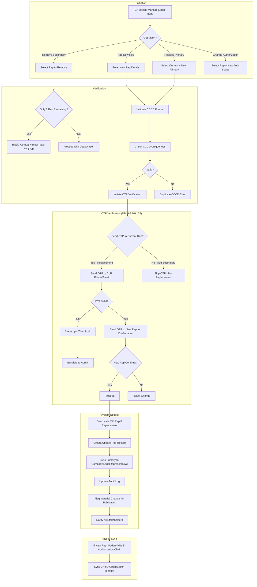

### Detailed Steps: Add Legal Representative (Secondary)

| # | Actor | Action | Validation | Error |
|---|-------|--------|------------|-------|
| 1 | CA | Navigate to Admin → Company → Legal Representatives | Permission check | 403 |
| 2 | CA | Click "Add Legal Representative" | Company type: if LLC1, enforce single rep only (BR-05) | LLC1 → "LLC1 allows only one legal rep. Use Replace instead." |
| 3 | CA | Enter FullName (required) | Max 200 chars, Vietnamese name format | Required validation |
| 4 | CA | Enter VNeIDNumber / CCCD (required) | 12 digits (new CCCD) or 9 digits (old CMND). Checksum validation for CCCD-12 | Format invalid → "VNeID number must be 12 digits (CCCD) or 9 digits (CMND)" |
| 5 | CA | Enter Position (required): e.g., "Giám đốc", "Chủ tịch HĐQT" | Max 200 chars | Required |
| 6 | CA | Set IsPrimary flag (if company has no primary yet) | Exactly 1 primary must exist. If setting primary → current primary becomes secondary | If already 1 primary → "Primary already exists. Set as primary will demote current." |
| 7 | CA | Enter AuthorizationScope (optional) | Free text describing scope of representation per Điều 13 | — |
| 8 | System | Validate CCCD uniqueness across active reps for this company | Query: no other active LegalRepresentative with same CCCD + same CompanyId | "This CCCD is already registered as a legal representative" |
| 9 | System | Save new LegalRepresentative record | IsActive=true, FromDate=today | DB failure → retry |
| 10 | System | If IsPrimary=true: update Company.LegalRepresentative, RepPosition | Sync fields from primary rep | Sync failure → alert admin |
| 11 | System | Log `LegalRepresentativeAdded` | OldValues=null, NewValues=full rep snapshot | — |
| 12 | System | Send notification to new rep: "You have been registered as legal representative for [CompanyName]" | Email to rep's email (if known) + in-app | Notification failure non-blocking |

### Detailed Steps: Replace Primary Legal Representative

| # | Actor | Action | Validation | Error |
|---|-------|--------|------------|-------|
| 1 | CA | Select current primary rep → click "Replace" | At least 2 reps needed (current + new) | If only 1 rep → "Add new rep first, then replace" |
| 2 | CA | Search and select new rep from existing list OR add new | — | — |
| 3 | System | Send OTP to CURRENT primary rep's registered phone/email | OTP valid for 5 minutes | 3 failed OTP attempts → lock change, escalate to SA |
| 4 | CLR | Enter OTP received | OTP = expected value within expiry | Invalid OTP → retry (max 3) |
| 5 | System | OTP verified: send confirmation request to NEW rep | New rep must confirm acceptance via link or OTP | New rep does not confirm within 24h → change expires |
| 6 | NLR | Confirm acceptance | Click confirmation link or enter OTP sent to their phone | Expired link → restart process |
| 7 | System | Both verifications complete: proceed with change | — | — |
| 8 | System | Deactivate old primary rep: IsActive=false, ToDate=now | Cannot be undone automatically | — |
| 9 | System | Set new rep as primary: IsPrimary=true, FromDate=today | Previously primary → secondary if exists | — |
| 10 | System | Sync Company.LegalRepresentative and RepPosition | From new primary rep | — |
| 11 | System | Log `PrimaryLegalRepresentativeChanged` | Old = previous primary rep, New = new primary rep | — |
| 12 | System | Flag material change for publication per NĐ 168 Điều 35 | Start 10-day timer | — |

### Detailed Steps: Remove Secondary Representative

| # | Actor | Action | Validation | Error |
|---|-------|--------|------------|-------|
| 1 | CA | Click "Remove" on non-primary legal rep | — | — |
| 2 | System | Check: will >= 1 active rep remain after removal? | Count active reps excluding this one | Only 1 rep remains → "Company must have at least one legal representative. Add a replacement first." |
| 3 | CA | Confirm removal with reason (required) | Reason: max 500 chars | Required field |
| 4 | System | Set IsActive=false, ToDate=now | Soft delete | — |
| 5 | System | Log `LegalRepresentativeRemoved` | With reason | — |

### VNeID Authorization Sync

When legal representative changes, the VNeID organization identity must be updated per NĐ 69/2024:

```
1. Trigger: LegalRep change committed
2. System checks: Company.VNeIDStatus == Verified?
3. If yes: Call VNeID API endpoint: UpdateOrganizationAuth
   - Payload: new rep's VNeIDNumber, Position, AuthorizationScope
4. If API succeeds: Update LegalRep.VNeIDVerifiedAt = now
5. If API fails:
   - Retry 3 times with 30s backoff
   - If still fails: Set LegalRep.VNeIDSyncPending = true
   - Notify CA: "VNeID authorization update pending. Retry now or contact VNeID support."
6. If VNeID not yet registered: No sync needed; will sync during VNeID registration (WF-07)
```

### Timing Constraints

| Condition | Constraint |
|-----------|------------|
| OTP expiry | 5 minutes from generation per NĐ 23/2025 |
| OTP max attempts | 3 failed attempts → lock change for 30 minutes |
| New rep confirmation window | 24 hours from request. Expires after (restart required) |
| Material change publication | Within 10 calendar days per NĐ 168 Điều 35 |
| VNeID API retry | 3 attempts with 30s backoff. Then flag for manual sync |
| Audit retention | 5 years minimum per Luật Kế toán 88/2015 |

### Error Handling Matrix

| Error | Detection | Response |
|-------|-----------|----------|
| CCCD duplicate | Step 8 | "This CCCD is already registered for this company's legal rep" |
| OTP invalid (3x) | Step 4 | "Too many invalid OTP attempts. Change locked for 30 minutes." |
| New rep confirmation expired | Step 6 | "Confirmation window expired. Please restart the replacement process." |
| Only 1 rep remaining | Step 2 (remove) | Block: "Company must have at least one legal representative" |
| LLC1 adding second rep | Step 2 (add) | Block: "LLC1 may have only one legal representative per Điều 12" |
| VNeID API unavailable | Sync step | Flag pending sync, retry via background job, notify admin |
| Concurrent rep change race | Save step | Concurrency token → "Another change in progress. Reload." |

### Integration Points

| Module | Integration |
|--------|------------|
| VNeID (WF-07) | LegalRep VNeIDNumber used for organization identity registration. Change triggers sync |
| Digital Signature (NĐ 23/2025) | LegalRep.DigitalCertSerial + Expiry used for e-signature on tax filings |
| Tax Declaration | Certain tax forms require primary legal rep's digital signature |
| National Business Portal | Rep change is material → must be published within 10 days |
| GL | LegalRep name appears on financial statements (BCĐKT, BCKQKD) for signature block |
| E-Invoice | Legal rep info on invoice template header |

---

## WF-07: VNeID / e-ID Registration

**Actors:** System Admin (SA), Legal Representative (LR), VNeID System (EID), System (SYS)

**Trigger:** Company needs to register organization identity on VNeID platform for electronic tax transactions

**Preconditions:**
1. Company exists with at least one active legal representative
2. Legal representative has personal VNeID Level-2 account (tài khoản định danh mức 2)
3. Company has valid Business Registration Certificate
4. Company tax code registered with tax authority
5. Internet connectivity to VNeID API gateway (Cổng dịch vụ công quốc gia)

**Postconditions:**
1. Company.VNeIDStatus = Registered or Verified
2. Company.VNeIDOrganizationId stored
3. Legal reps linked to VNeID organization account
4. Company can now perform tax e-transactions per NĐ 69/2024 Điều 14
5. Daily sync background job scheduled
6. Audit log: `VNeIDRegistrationCompleted`

### Workflow

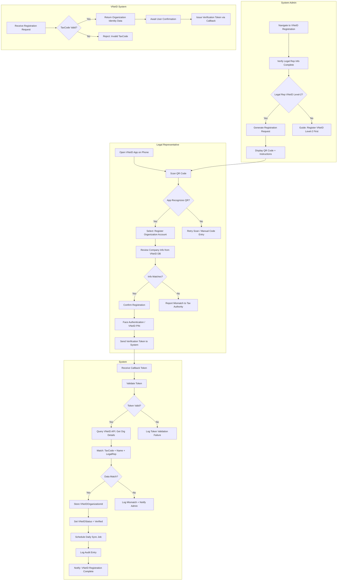

### Detailed Steps

| # | Actor | Action | Validation | Error Handling |
|---|-------|--------|------------|----------------|
| 1 | SA | Navigate to Admin → Company → VNeID Registration | Permission `Company.ManageVNeID` | 403 |
| 2 | SA | Verify legal rep info complete (VNeIDNumber, FullName, Position) | At least 1 active legal rep with VNeIDNumber | "Complete legal representative info first" → redirect to LegalRep tab |
| 3 | SA | Click "Start VNeID Registration" | Generate unique request ID + QR code | QR generation failure → retry |
| 4 | SYS | Display QR code (valid 5 minutes) + step-by-step instructions | QR encodes: requestId, callback URL, company info hash | — |
| 5 | LR | Open VNeID app on phone, scan QR code | VNeID app must be authenticated with Level-2 account | No Level-2 → "VNeID Level-2 required" guide |
| 6 | EID | Receive registration request; validate TaxCode against national database | TaxCode must exist in national population DB | "TaxCode not found in national database. Contact tax authority." |
| 7 | LR | Review company info returned by VNeID: Name, TaxCode, Address | Confirm all fields match business registration certificate | Info mismatch → "Contact tax authority to update records" |
| 8 | LR | Authenticate via VNeID: face scan or VNeID PIN | Biometric verification per NĐ 69/2024 Điều 8 | Authentication failed → 3 attempts then lock 30min |
| 9 | EID | Send verification token to system callback URL (POST /api/vneid/callback) | Token: JWT signed by VNeID, valid 60s | Callback timeout → LR must retry |
| 10 | SYS | Receive callback, validate token signature | Decode JWT with VNeID public key | Invalid signature → reject, log security event |
| 11 | SYS | Query VNeID API for organization details (GET /api/v2/organization/{taxCode}) | API returns: OrgId, Name, TaxCode, LegalReps, Address | API timeout → retry 3x with 5s backoff. Max 15s total |
| 12 | SYS | Compare returned data with local Company record | TaxCode must match exactly. Name fuzzy match allowed (90% similarity) | Mismatch → log details, notify SA, set status Mismatch |
| 13 | SYS | On match: store VNeIDOrganizationId on Company | Update Company.VNeID fields | DB write failure → retry |
| 14 | SYS | Set VNeIDStatus = Verified, VNeIDRegistrationDate = now | — | — |
| 15 | SYS | Schedule daily sync background job (Quartz/Hangfire) | Sync job: check VNeID status every 24h | Schedule failure → alert ops |
| 16 | SYS | Log `VNeIDRegistrationCompleted` | With VNeIDOrganizationId, legal rep info | — |
| 17 | SYS | Notify SA + legal rep: "VNeID registration successful" | Email + in-app | Notification failure non-blocking |

### QR Code Timeout and Retry

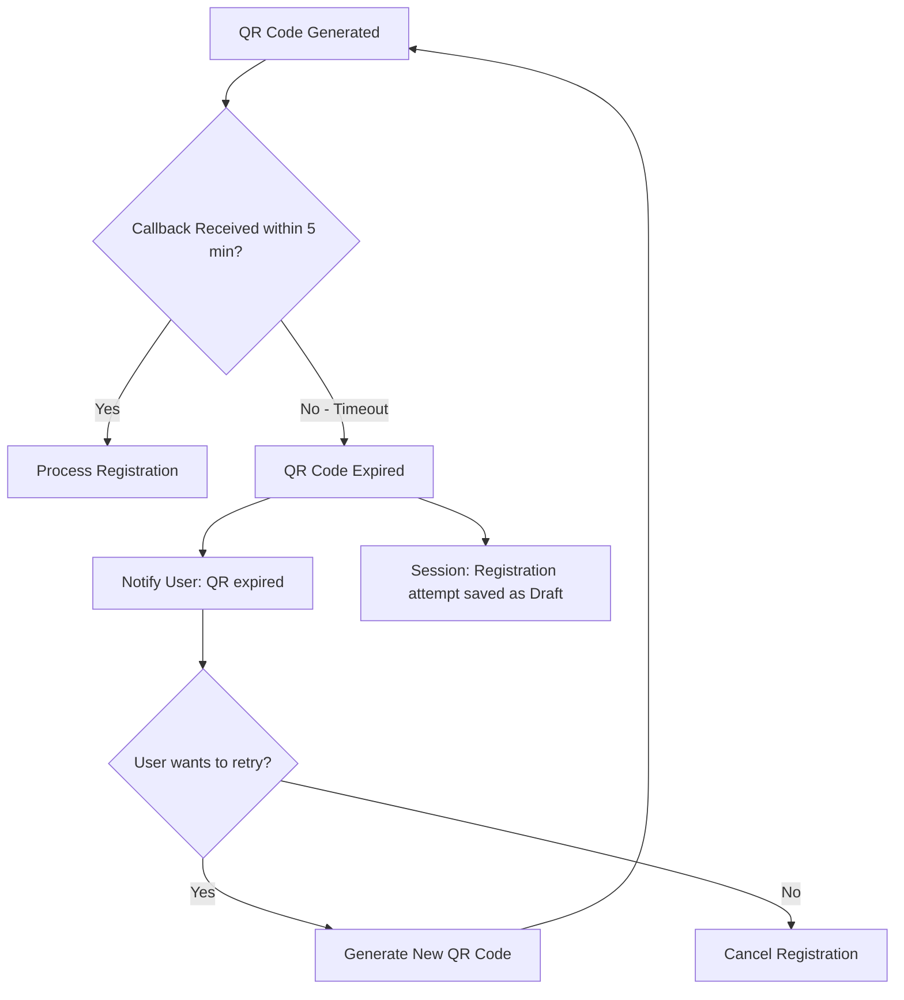

### Daily Sync Background Job

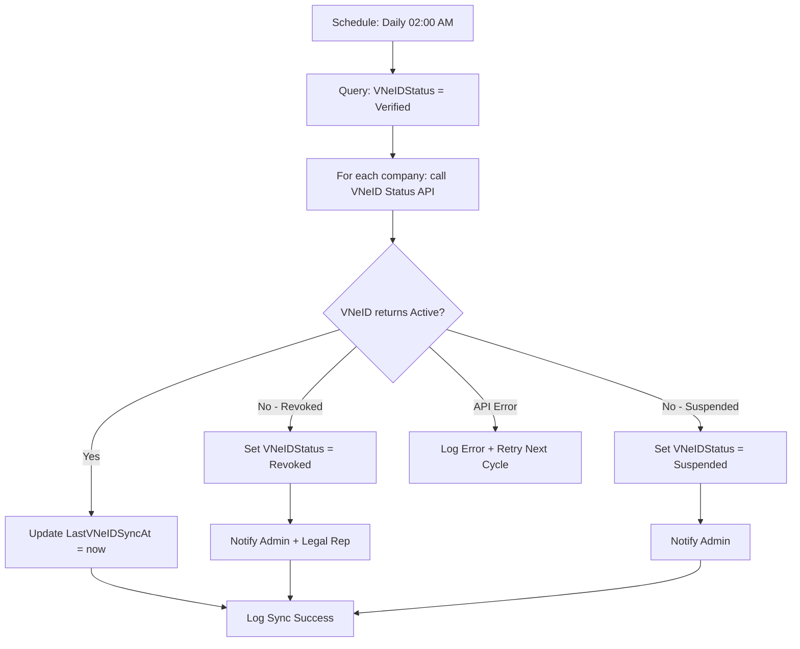

### Timing Constraints

| Condition | Constraint |
|-----------|------------|
| QR code validity | 5 minutes from generation |
| VNeID callback timeout | System must accept callback within 60s of send |
| API call timeout | 5s per call, max 3 retries = 15s total |
| Face authentication lockout | 3 failed attempts → 30-minute lock |
| Daily sync job | Runs 02:00 AM daily, max 30min execution |
| VNeID registration attempt draft | Saved for 7 days before auto-clear |

### Error Handling Matrix

| Error | Detection | Response | Recovery |
|-------|-----------|----------|----------|
| QR code expired | Step 4→5 timeout | "QR expired. Generate new code." | Generate fresh QR + retry |
| VNeID callback timeout | Step 9→10 | System did not receive callback within 5 min | LR must rescan QR |
| Invalid callback token | Step 10 | Token signature verification failed | Log security alert, reject, notify SA |
| TaxCode mismatch with VNeID DB | Step 12 | Company.TaxCode ≠ VNeID.returnedTaxCode | "TaxCode mismatch. Update at tax authority first." |
| VNeID API unavailable | Step 11 | HTTP 503 / timeout after 3 retries | "VNeID service unavailable. Save draft and retry later." |
| Legal rep VNeID Level-2 missing | Step 2 check | "Legal rep does not have VNeID Level-2 account" | Show guide for VNeID Level-2 registration |
| Bio authentication failed (3x) | Step 8 | "Authentication locked for 30 minutes" | LR waits or contacts VNeID support |
| Daily sync finds revoke | Sync job | VNeIDStatus=Revoked → block tax transactions | Admin must re-register |

### Integration Points

| Module | Integration |
|--------|------------|
| Tax Declaration | VNeIDStatus must be Verified to enable tax e-filing. Blocked if NotRegistered or Revoked |
| Legal Representative (WF-06) | VNeIDNumber from LegalRep used for registration. Rep change triggers VNeID sync |
| Digital Signature (NĐ 23/2025) | VNeID organization account enables authorized digital signatures on filings |
| GL / Financial Ops | Certain high-value transactions may require VNeID-verified rep approval |
| National Business Portal | VNeID organization identity used for automated publication of company changes |
| Audit | All VNeID registration events logged. Daily sync results tracked |

---

## WF-08: Year-End Company Data Lock

**Actors:** Chief Accountant (KT), System (SYS), Legal Representative (LR)

**Trigger:** End of fiscal year — system initiates closure process, admin confirms data freeze

**Preconditions:**
1. Current fiscal year end date reached (or manual trigger for early close)
2. All journal entries for the year are posted (no unposted entries)
3. All tax declarations for the year are filed
4. User has permission `Company.ClosePeriod`
5. Chief Accountant approval required for final lock

**Postconditions:**
1. All periods in fiscal year set to IsClosed = true
2. No new journal entries can be posted to closed periods
3. Opening balances for new fiscal year generated
4. Carry-forward entries created (based on ending balances)
5. CompanySettings.LastPeriodClosed updated
6. CompanySettings.DecimalPlaces locked (cannot change)
7. Data frozen for audit purposes
8. Audit log: `FiscalYearClosed`

### Workflow

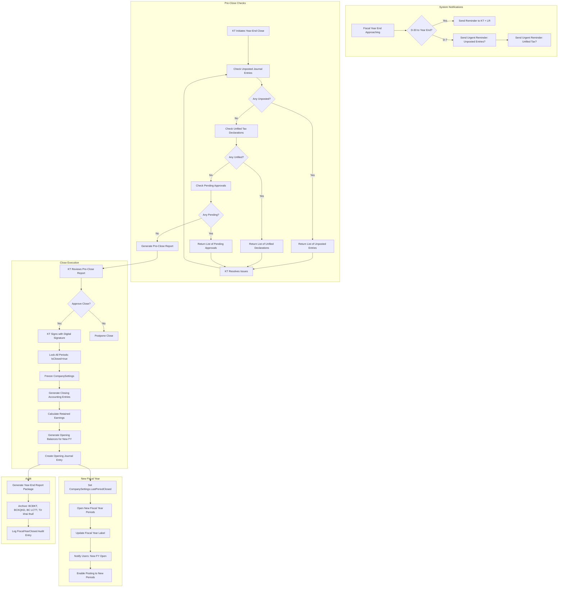

### Detailed Steps

| # | Actor | Action | Validation | Error Handling |
|---|-------|--------|------------|----------------|
| 1 | SYS | At D-30 to FY end: send reminder to KT and LR | Automatic scheduled job | Notification failure → retry daily |
| 2 | SYS | At D-7: send urgent reminder listing unposted entries + unfiled tax declarations | Query JournalEntry where IsPosted=false AND Period.FiscalYear=current. Query TaxDeclaration where Status != Filed AND Period=current | — |
| 3 | KT | Navigate to Admin → Company → Period Close | Permission `Company.ClosePeriod` | 403 |
| 4 | SYS | Run pre-close checks: | — | — |
| 4a | SYS | Check unposted JE | Count entries where IsPosted=false | If > 0: return list with entry numbers, dates, amounts |
| 4b | SYS | Check unfiled tax declarations | Count declarations where Status != Filed | If > 0: return list with declaration types, periods |
| 4c | SYS | Check pending approvals | Count approval requests where Status = Pending | If > 0: return list |
| 4d | SYS | Check inventory valuation (if applicable) | Verify InventoryItem.TotalQuantity = sum of movements | Discrepancy → warning but non-blocking |
| 4e | SYS | Check fixed asset depreciation | Verify all assets have depreciation recorded for full year | Missing depreciation → warning |
| 5 | SYS | Generate Pre-Close Report | PDF containing: trial balance, unposted entries, unfiled taxes, pending approvals, inventory status, asset depreciation | Report generation failure → retry |
| 6 | KT | Review Pre-Close Report | If issues → resolve or postpone | — |
| 7 | KT | Approve close: click "Lock Fiscal Year" | Confirmation dialog: "This action will permanently lock all periods in fiscal year [YYYY]. Continue?" | — |
| 8 | SYS | Require digital signature per NĐ 23/2025 | KT must sign with registered e-certificate | No e-cert → "Digital signature required. Configure in Settings." |
| 9 | KT | Sign with digital signature | Validate cert: not expired, from licensed CA, matches KT identity | Cert expired → "Digital certificate expired [X] days ago. Renew before closing." |
| 10 | SYS | Lock all periods in fiscal year | Set Period.IsClosed = true for all 12 monthly periods + annual period | Period lock failure → rollback + alert |
| 11 | SYS | Freeze CompanySettings: set IsLocked flags | DecimalPlaces, InventoryMethod, TaxCalculationMethod locked | — |
| 12 | SYS | Generate closing entries | | |
| 12a | SYS | Close revenue accounts (Doanh thu) → Debit revenue, Credit retained earnings | Based on ending balances per account | Calculate mismatch → flag for manual review |
| 12b | SYS | Close expense accounts (Chi phí) → Credit expense, Debit retained earnings | Based on ending balances | Calculate mismatch → flag |
| 12c | SYS | Calculate net income/loss: RetainedEarnings = Revenue - Expenses | Must balance to 0 debit/credit | Imbalance → prevent close, notify KT |
| 13 | SYS | Generate opening balances for new fiscal year | Copy ending balances → opening balances per account | Balance copy failure → retry |
| 14 | SYS | Create Opening Journal Entry | Single entry: all asset/liability/equity accounts with opening balances | Entry creation failure → rollback close |
| 15 | SYS | Set CompanySettings.LastPeriodClosed = [last day of FY] | Update timestamp | — |
| 16 | SYS | Activate new fiscal year periods | Generate period definitions for new FY with IsOpen = true | Generation failure → alert ops |
| 17 | SYS | Notify all users: "Fiscal year [YYYY] closed. New fiscal year [YYYY+1] open for posting." | In-app notification + email | — |
| 18 | SYS | Archive annual reports to CompanyDocument store | Generate final BCĐKT, BCKQKD, BCLCTT as PDF, store with FiscalYear tag | Archive failure → retry background job |
| 19 | SYS | Log `FiscalYearClosed` | With: Year, ClosedBy(UserId), EntryCount, PeriodCount, Timestamp, ClosingEntryIds | — |

### Accounting Entries Generated

| Entry Type | Debit (Nợ) | Credit (Có) | Description |
|------------|-----------|-------------|-------------|
| Close Revenue | Revenue accounts (511, 515, 711) | Retained Earnings (421) | Kết chuyển doanh thu |
| Close Expense | Retained Earnings (421) | Expense accounts (632, 641, 642, 635, 811, 821) | Kết chuyển chi phí |
| Opening Balances | Asset accounts (111, 112, 131, 152...) | Liabilities + Equity (331, 341, 411, 421...) | Số dư đầu kỳ |

### Retained Earnings Calculation

```
Đầu năm LNST = Lợi nhuận sau thuế TNDN
           = (Doanh thu thuần - Giá vốn - Chi phí QLDN - Chi phí BH - Chi phí TC
              + Doanh thu TC + Thu nhập khác - Chi phí khác)
           × (1 - Thuế suất TNDN)

Carry to: TK 4211 (Lợi nhuận sau thuế chưa phân phối năm nay)
     or: TK 4212 (Lợi nhuận sau thuế chưa phân phối năm trước - after closing)
```

### Pre-Close Validation Rules

| Check | Validation | Blocking? | Resolution |
|-------|-----------|-----------|------------|
| Unposted JE | COUNT WHERE IsPosted = false | Warning (advisory) | Post or delete unposted entries |
| Unfiled tax | COUNT WHERE Status != Filed | **Blocking** per TT 99 Điều 29 | Complete all tax filings |
| Pending approvals | COUNT WHERE Status = Pending | Warning | Approve or reject pending items |
| Inventory balance | Total quantity = SUM(movements) | Warning | Investigate and adjust |
| Fixed asset depreciation | All assets depreciated for full year | Warning | Record missing depreciation |
| Retained earnings balance | Total (Revenue - Expenses) = 0 | **Blocking** | Review P&L accounts, correct |
| Trial balance | Total debit = total credit | **Blocking** | Re-run trial balance, fix errors |
| Digital signature | Valid e-cert on file | **Blocking** per NĐ 23/2025 | Configure e-certificate |

### Timing Constraints

| Condition | Constraint |
|-----------|------------|
| Pre-close reminder starts | 30 days before fiscal year end |
| Urgent reminder | 7 days before fiscal year end |
| Close deadline | Within 90 days of FY end per TT 99 Điều 29 (for annual report submission) |
| Closing execution | System-generated entries processed within 5 minutes (sync) |
| Opening balance generation | Must complete before next period opens (same transaction) |
| Data lock | Irreversible — cannot un-close a period once locked |
| Archive report generation | Within 1 hour of close completion (async job) |

### Error Handling Matrix

| Error | Detection | Response | Recovery |
|-------|-----------|----------|----------|
| Unposted entries exist | Pre-check 4a | List entries with links to post | User posts or deletes, retries close |
| Unfiled tax declarations | Pre-check 4b | List declarations with links to file | User files, retries close. **Blocking** |
| Trial balance imbalance | Pre-check balance | "Trial balance does not balance. Difference: [amount]" | KT reviews and corrects GL |
| Digital signature failure | Step 8 | "Signing failed: [cert error]" | Check cert validity, retry |
| Closing entry imbalance | Step 12 | "Closing entries do not balance. Contact support." | Manual intervention required |
| Opening balance creation fails | Step 14 | "Failed to create opening entry. Year-end close rolled back." | System alert to ops, retry after fix |
| Period lock partial failure | Step 10 | Some periods locked, some not. Rollback. | Retry with idempotency key |
| Concurrent close attempt | Step 10 | "Another year-end close already in progress" | Wait for existing to complete |
| Archive storage failure | Step 18 | "Report archive failed. Will retry." | Background retry with alert if persistent |

### Integration Points

| Module | Integration |
|--------|------------|
| GL | Period.IsClosed gates all JE creation. Opening balances carry forward accounts. Retained earnings calculated |
| Tax Declaration | All tax periods must be filed before close. Final annual tax return generated from closed data |
| Inventory | Ending inventory valuation frozen. Opening inventory = closing balance of prior year |
| Fixed Assets | Full year depreciation posted. NBV carried to new year |
| AR / AP | Outstanding balances carried forward. Aging report frozen at close date |
| Cash / Bank | Ending balances carried forward. Bank reconciliation must be current before close |
| Report | Annual financial statements generated (BCĐKT, BCKQKD, BCLCTT, TM15). Archived as CompanyDocument |
| Audit | Full audit trail of close process. All closing entries logged. Audit report package generated |
| Settings | DecimalPlaces, InventoryMethod, TaxCalculationMethod locked after first close |

---

## Appendix A: Workflow Dependency Graph

```
WF-01 (Registration)
  └──► WF-04 (Fiscal Year Setup) — must run after registration
  └──► WF-07 (VNeID) — recommended after registration, required before tax filing

WF-02 (Info Change)
  └──► WF-06 (Legal Rep Change) — may be triggered by info change
  └──► WF-07 (VNeID Sync) — legal rep change triggers VNeID sync

WF-03 (Status Change)
  └──► WF-08 (Year-End Close) — must complete before dissolution

WF-05 (Multi-Company)
  └──► Parallel to all workflows — cross-cutting concern

WF-06 (Legal Rep Change)
  └──► WF-07 (VNeID Sync) — legal rep change must propagate to VNeID

WF-07 (VNeID Registration)
  └──► Tax Declaration module — VNeID status gates tax filing

WF-08 (Year-End Close)
  └──► GL module — creates closing entries, opening balances
  └──► Inventory module — freezes inventory valuation
  └──► Tax module — triggers final annual tax filing
```

## Appendix B: Law Reference Quick-Index

| WF | Key Law | Articles |
|----|---------|----------|
| WF-01 | NĐ 168/2025/NĐ-CP, Luật DN 2020 | Điều 5, 29-30, 37-38 |
| WF-02 | NĐ 168/2025/NĐ-CP, TT 99/2025/TT-BTC | Điều 28, 31, 35; Điều 28 (audit) |
| WF-03 | Luật DN 2020, NĐ 01/2021 | Điều 206-210; Điều 66, 75 |
| WF-04 | TT 99/2025/TT-BTC, Luật Kế toán 88/2015 | Điều 5-8, 10, 12, 25; Điều 11-12 |
| WF-05 | TT 99/2025/TT-BTC (data separation) | Điều 28 (nguyên tắc phân tách) |
| WF-06 | Luật DN 2020, NĐ 69/2024, NĐ 23/2025 | Điều 12-16; Điều 8; Điều 9 |
| WF-07 | NĐ 69/2024/NĐ-CP, NĐ 168/2025 | Điều 8, 14; Điều 41 |
| WF-08 | VAS 01, TT 99/2025/TT-BTC, NĐ 23/2025 | Chuẩn mực chung; Điều 29; Điều 9 |

---

## Appendix C: Actor Permissions Summary

| Permission | WF-01 | WF-02 | WF-03 | WF-04 | WF-05 | WF-06 | WF-07 | WF-08 |
|------------|-------|-------|-------|-------|-------|-------|-------|-------|
| Company.Create | R | — | — | — | — | — | — | — |
| Company.Update | — | R | — | — | — | — | — | — |
| Company.UpdateTaxCode | — | R | — | — | — | — | — | — |
| Company.UpdateSettings | — | — | — | R | — | — | — | — |
| Company.ChangeStatus | — | — | R | — | — | — | — | — |
| Company.AssignUser | — | — | — | — | R | — | — | — |
| Company.ManageLegalReps | — | — | — | — | — | R | — | — |
| Company.ManageVNeID | — | — | — | — | — | — | R | — |
| Company.ClosePeriod | — | — | — | — | — | — | — | R |

R = Required for this workflow. — = Not required.

(Document end)
