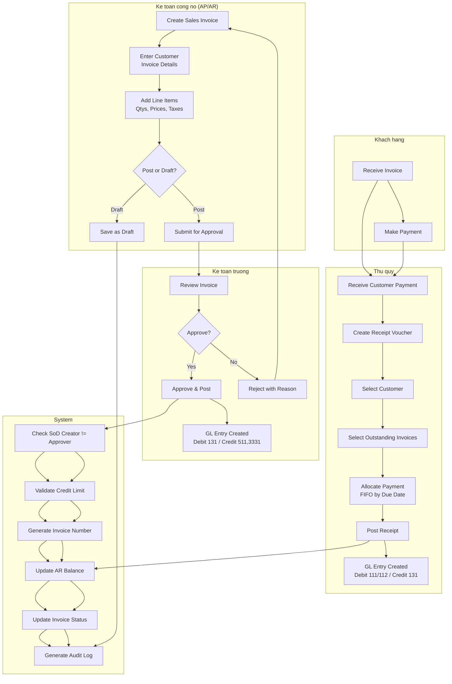
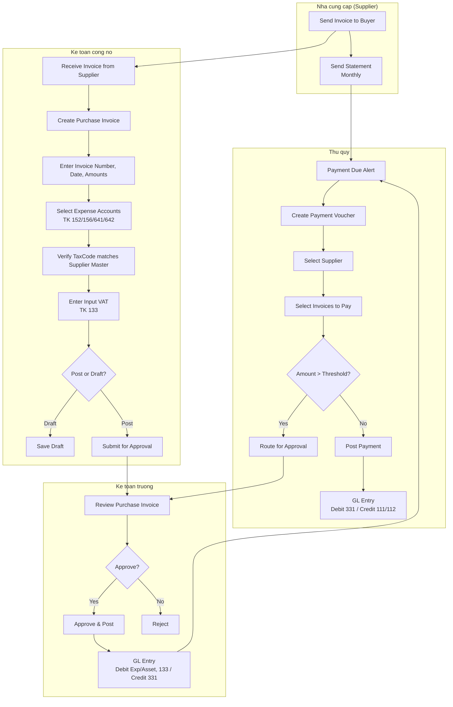
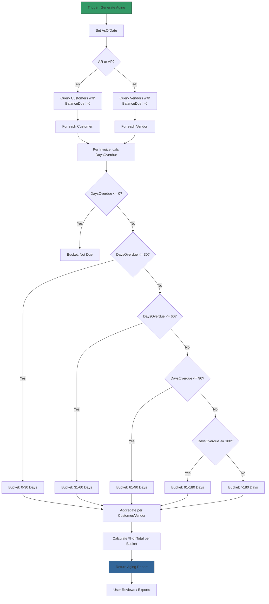
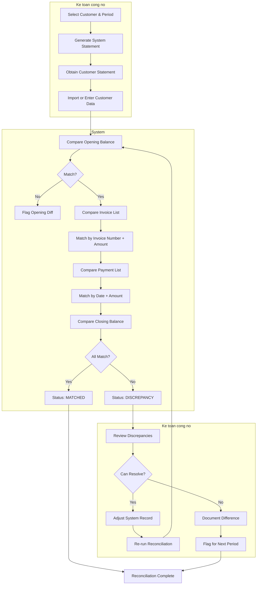
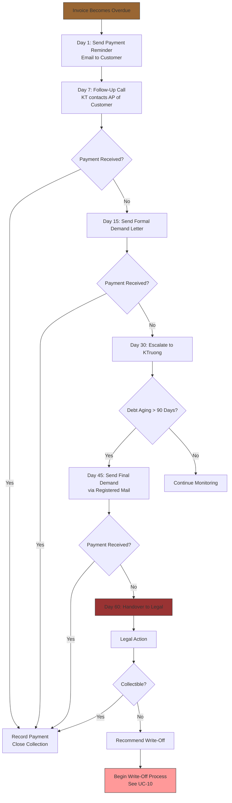

# Workflows — Dept Module (Cong no — AP/AR)

**Domain:** Cong no (Accounts Payable/Receivable)
**Module:** Dept Management
**Regulatory basis:** TT 99/2025/TT-BTC, TT 133/2016/TT-BTC, VAS 01, VAS 10, VAS 18, TT 48/2019/TT-BTC, ND 254/2026/ND-CP

---

## W-01: Sales-to-Receipt Cycle (Full AR Lifecycle)

**Actors:** Ke toan cong no (KT), Thu quy (TQ), Ke toan truong (KTruong), Khach hang (KH)

**Trigger:** Customer places order or requests credit sale

**Preconditions:**
1. Customer master record exists
2. Sales invoice is authorized per company policy
3. TK 131 is active in chart of accounts

**Postconditions:**
1. Invoice posted with GL entry (Debit 131, Credit 511, Credit 3331)
2. Receipt recorded with GL entry (Debit 111/112, Credit 131)
3. Invoice fully or partially paid
4. Audit trail complete

### Swimlane Flow



### Step Details

| Step | Actor | Action | System Response | Validation |
|------|-------|--------|-----------------|------------|
| 1 | KT | Create sales invoice | Display blank invoice form | Permission `dept:invoice:create` |
| 2 | KT | Select customer, enter date/due date | Look up customer, auto-fill info | Customer exists, active |
| 3 | KT | Add line items | Calculate totals, validate credit limit | LineTotal = Qty x Price; Total <= CreditLimit - Outstanding |
| 4 | KT | Post or save draft | If Post: route to approval. If Draft: save pending | SoD: if same user is approver, require second approval |
| 5 | KTruong | Review and approve | Create GL entry, update invoice status | CreatorId != ApproverId |
| 6 | TQ | Receive payment | Create receipt voucher | Permission `dept:payment:create` |
| 7 | TQ | Select invoices to pay | Show outstanding invoices FIFO | Allocation total <= Payment amount |
| 8 | TQ | Post receipt | Create GL entry, update invoice balances | SoD: TQ != invoice creator |

---

## W-02: Purchase-to-Payment Cycle (Full AP Lifecycle)

**Actors:** Ke toan cong no (KT), Ke toan truong (KTruong), Thu quy (TQ), Nha cung cap (NCC)

**Trigger:** Purchase invoice received from supplier

**Preconditions:**
1. Supplier master record exists
2. Purchase invoice physically or electronically received from supplier

**Postconditions:**
1. Purchase invoice posted with GL entry (Debit expense/asset, Debit 133, Credit 331)
2. Payment recorded with GL entry (Debit 331, Credit 111/112)
3. Invoice fully or partially paid

### Swimlane Flow



### Step Details

| Step | Actor | Action | System Response | Validation |
|------|-------|--------|-----------------|------------|
| 1 | KT | Receive supplier invoice | — | — |
| 2 | KT | Create purchase invoice | Display form | Supplier exists |
| 3 | KT | Enter invoice details | Load supplier info | Invoice number unique per supplier |
| 4 | KT | Select expense accounts | Show COA filtered by expense type | Account type must be expense/asset |
| 5 | KT | Verify tax code | Compare master vs invoice | Warn on mismatch |
| 6 | KT | Enter input VAT | Calculate tax amounts | TaxRate valid per regime |
| 7 | KT | Post or save draft | Route to approval or save | — |
| 8 | KTruong | Approve | Create GL, update status | SoD: Creator != Approver |
| 9 | TQ | Pay supplier | Create disbursement | Approval threshold check |

---

## W-03: Debt Aging Calculation (Phan tich tuoi no)

**Actors:** System (automated), Ke toan truong (review)

**Trigger:** Request for aging report (AR aging, AP aging, or provision calculation)

**Preconditions:**
1. Invoices exist with status Posted and BalanceDue > 0
2. AsOfDate specified

**Postconditions:**
1. Aging data computed per customer/vendor per bucket
2. No database writes (aging is computed query, unless materialized for performance)

### Flow



### Aging Bucket Definitions (Vietnamese Practice)

| Bucket ID | Label | Days Overdue | TT 48/2019 Provision Rate |
|-----------|-------|-------------|--------------------------|
| 0 | Chua den han (Not due) | <= 0 | 0% |
| 1 | Trong han 30 ngay | 1-30 | 0% |
| 2 | Qua han 31-60 ngay | 31-60 | 5% |
| 3 | Qua han 61-90 ngay | 61-90 | 10% |
| 4 | Qua han 91-180 ngay | 91-180 | 20% |
| 5 | Qua han 181-365 ngay | 181-365 | 50% |
| 6 | Qua han tren 365 ngay | >365 | 100% |

Note: The 181-365 and >365 buckets are used for provision calculation per TT 48 but consolidated into >180 for standard aging reports. The software MUST support both the 6-bucket report view and the 7-bucket provision calculation view.

---

## W-04: Bad Debt Provision Calculation (Trich lap du phong)

**Actors:** Ke toan truong (initiate and post)

**Trigger:** Year-end closing or mid-year assessment

**Preconditions:**
1. AR aging computed as of period end date
2. Company settings define provision method (TT 48/2019 only in v1)
3. Existing provision balance (if any) known

**Postconditions:**
1. Provision calculated per TT 48/2019 rates
2. GL entry posted (Debit 6426, Credit 2293)
3. Provision schedule created for audit trail

### Flow

```mermaid
graph TD
    A[Period End Date Set] --> B[Run AR Aging as of Period End]
    B --> C[Filter Out Excluded Items]
    C --> C1[Exclude: credit balance customers]
    C1 --> C2[Exclude: inter-company balances]
    C2 --> C3[Exclude: secured debts]
    C3 --> D[For Each Customer:]

    D --> E[Aggregate Balance per Bucket]
    E --> F[Apply Provision % per Bucket]
    
    F --> G1[Bucket 0-30: 0%]
    F --> G2[Bucket 31-60: 5%]
    F --> G3[Bucket 61-90: 10%]
    F --> G4[Bucket 91-180: 20%]
    F --> G5[Bucket 181-365: 50%]
    F --> G6[Bucket >365: 100%]

    G1 --> H[Customer Provision = Sum per Bucket]
    G2 --> H
    G3 --> H
    G4 --> H
    G5 --> H
    G6 --> H

    H --> I[Total Provision = Sum all Customers]
    I --> J[Compare with Existing<br/>Provision Balance (TK 2293)]
    J --> K{Difference > 0?}
    K -->|Yes - Additional| L1[New Provision: Debit 6426 / Credit 2293]
    K -->|No - Reversal| L2[Reversal: Credit 6426 / Debit 2293]
    K -->|Zero| L3[No Entry Needed]
    L1 --> M[Generate Provision Report]
    L2 --> M
    L3 --> M
    M --> N[User Reviews & Posts]
    N --> O[Audit Trail: ProvisionCreated]

    style A fill:#396,stroke:#333
    style O fill:#369,stroke:#333
```

### Provision Calculation per TT 48/2019/TT-BTC Dien 6

```
Provision_i = Sum_over_buckets( Balance_i_bucket x Rate_bucket )
Total_Provision = Sum_over_customers( Provision_i )
Adjustment = Total_Provision - Existing_Provision_Balance
```

Where:
- Balance_i_bucket = total outstanding for customer i in bucket b
- Rate_bucket = provision rate for bucket b per table above
- Existing_Provision_Balance = current credit balance of TK 2293
- If Adjustment > 0: additional provision (Debit 6426, Credit 2293)
- If Adjustment < 0: reversal (Credit 6426, Debit 2293)

---

## W-05: Customer Account Reconciliation (Doi chieu cong no)

**Actors:** Ke toan cong no (KT), Khach hang (KH)

**Trigger:** Monthly/quarterly customer statement review, or customer disputes balance

**Preconditions:**
1. Customer has at least one transaction in period
2. Customer statement available (from customer or system-generated)

**Postconditions:**
1. Reconciliation record created
2. Discrepancies identified and documented
3. Either confirmed matched or flagged for investigation

### Swimlane Flow



### Reconciliation Categories

| Category | Description | Resolution |
|----------|-------------|------------|
| Opening balance diff | Prior period mismatch | Investigate prior period transactions |
| Invoice in system not in customer | Customer does not acknowledge invoice | Send copy to customer, verify delivery |
| Invoice in customer not in system | Customer claims invoice not recorded | Verify if invoice belongs to company |
| Payment in system not in customer | Customer claims they paid but not recorded | Check bank statement, trace payment |
| Payment in customer not in system | Customer paid but not received | Check bank, record missing receipt |
| Timing difference | Transaction near period boundary | Note for next period reconciliation |
| Amount difference | Quantity or price dispute | Verify contract/purchase order terms |

---

## W-06: AR/AP Offset (Bu tru cong no phai thu / phai tra)

**Actors:** Ke toan truong (KTruong), Giam doc (GD — for large offsets)

**Trigger:** Entity is both customer and supplier, mutual offset agreement exists

**Preconditions:**
1. Same entity (or linked entities) has both AR and AP balances
2. Bilateral offset agreement signed
3. Legal right of offset exists per VAS 01

**Postconditions:**
1. Offset executed: Debit TK 331, Credit TK 131
2. Both balances reduced
3. Offset agreement documented in audit trail

### Flow

```mermaid
graph TD
    A[Identify Dual-Role Entity] --> B[Verify AR Balance > 0]
    B --> C[Verify AP Balance > 0]
    C --> D[Set Offsettable Amount = Min(AR, AP)]
    D --> E[Enter Offset Amount]
    E --> F[Upload Offset Agreement]
    F --> G{Amount > Threshold?}
    G -->|Yes| H[Route to Giam doc Approval]
    G -->|No| I[Ke toan truong Approves]
    H --> J[Post Offset]
    I --> J
    J --> K[GL Entry: Debit 331 / Credit 131]
    K --> L[Update Invoice Allocations]
    L --> M[Update AR/AP Balances]
    M --> N[Audit Log: OffsetCompleted]

    style A fill:#396,stroke:#333
    style N fill:#369,stroke:#333
```

### Allocation Rules for Offset

When multiple invoices exist on both sides:

1. Offsetting party's AP invoices are matched against customer's AR invoices
2. Default: FIFO (oldest invoices first)
3. Manual override: user selects specific invoice pairs
4. Remaining balances persist on both sides after offset

---

## W-07: Debt Collection Process (Quy trinh thu hoi cong no)

**Actors:** Ke toan cong no (KT), Ke toan truong (KTruong), Bo phan phap ly (Legal), Khach hang (KH)

**Trigger:** Invoice reaches overdue status (past due date)

**Preconditions:**
1. Invoice status = Posted and BalanceDue > 0
2. DueDate < current date

**Postconditions:**
1. Collection actions recorded per escalation level
2. Customer contact log updated
3. Escalation triggered if no payment received

### Flow



### Collection Escalation Matrix

| Level | Timeframe | Action | Responsible |
|-------|-----------|--------|-------------|
| 1 | Day 1 overdue | Email reminder (auto) | System |
| 2 | Day 7 overdue | Phone call | Ke toan cong no |
| 3 | Day 15 overdue | Formal demand letter (van ban) | Ke toan cong no |
| 4 | Day 30 overdue | Notify ke toan truong | Ke toan cong no |
| 5 | Day 45 overdue | Final demand, registered mail | Ke toan truong |
| 6 | Day 60 overdue | Legal team / collection agency | Bo phan phap ly |

---

## W-08: Month-End AR/AP Closing (Khoa so cuoi thang cong no)

**Actors:** Ke toan tong hop (KTH), Ke toan cong no (KT), Ke toan truong (KTruong)

**Trigger:** Last day of accounting period (month/quarter/year)

**Preconditions:**
1. All transactions for period have been entered
2. No pending approvals for period transactions
3. Bank reconciliation up to date (if bank module exists)

**Postconditions:**
1. All AR/AP transactions posted to GL
2. Aging reports generated for period end
3. Provision calculated (if year-end)
4. Period closed for AR/AP transactions

### Flow

```mermaid
graph TD
    A[Start Month-End AR/AP Close] --> B[Step 1: Post All Pending Invoices]
    B --> C[Step 2: Post All Pending Payments]
    C --> D[Step 3: Reconcile All Payments<br/>to Bank Statement]
    D --> E[Step 4: Run AR Aging as of Period End]
    E --> F[Step 5: Run AP Aging as of Period End]
    F --> G{Year-End?}
    G -->|Yes| H[Step 6: Calculate Bad Debt Provision]
    G -->|No| I[Skip Provision]
    H --> J[Step 7: Run Customer Statements]
    I --> J
    J --> K[Step 8: Run Supplier Statements]
    K --> L[Step 9: Generate So chi tiet<br/>cong no phai thu (Mau S03b-DN)]
    L --> M[Step 10: Generate So chi tiet<br/>cong no phai tra (Mau S04-DN)]
    M --> N[Step 11: Print/Export All Reports]
    N --> O[Step 12: Verify AR = Debit balance TK 131<br/>in GL Trial Balance]
    O --> P{Match?}
    P -->|Yes| Q[AR/AP Close Complete]
    P -->|No| R[Investigate Discrepancy]
    R --> O

    style A fill:#693,stroke:#333
    style Q fill:#369,stroke:#333
    style R fill:#933,stroke:#333
```

### Month-End Checklist

| # | Item | Responsible | Verification |
|---|------|-------------|--------------|
| 1 | All invoices posted; no Drafts older than 3 days | Ke toan cong no | Query: Status=Draft AND CreatedDate < PeriodEnd-3 |
| 2 | All payments allocated; no unallocated amounts | Ke toan cong no | Sum of InvoicePaymentAllocation = Payment.TotalAmount |
| 3 | GL posting complete for all dept transactions | Ke toan tong hop | Compare dept transaction count vs GL entry count |
| 4 | AR aging report generated | Ke toan cong no | Report date = PeriodEnd |
| 5 | AP aging report generated | Ke toan cong no | Report date = PeriodEnd |
| 6 | Customer statements generated | Ke toan cong no | All active customers |
| 7 | Supplier statements generated | Ke toan cong no | All active suppliers |
| 8 | Bad debt provision (year-end) | Ke toan truong | Posted to GL |
| 9 | AR balance = TK 131 GL balance | Ke toan tong hop | Sum(AR) = GL trial balance for 131 |
| 10 | AP balance = TK 331 GL balance | Ke toan tong hop | Sum(AP) = GL trial balance for 331 |
| 11 | So chi tiet printed/signed | Ke toan truong | Physical or digital signature |
| 12 | Reports archived for 5-year retention | System | Per Luat Ke toan 2015 Dieu 41 |
