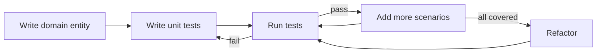

# Test Process — SmeAccounting

**Version:** 1.0  
**Date:** 2026-07-16  
**Standard:** ISO/IEC/IEEE 29119-2 (Test Processes)  
**Lifecycle:** V-Model within Scrum (2-week sprints)

---

## 1. Test Activities per Sprint

```
┌──────────────────────────────────────────────────────────────┐
│                      SPRINT BACKLOG                          │
├──────────────────────────────────────────────────────────────┤
│  Day 1-2: Test Planning & Design                             │
│    → Review user stories, identify test scenarios            │
│    → Update traceability matrix                              │
│    → Write integration test stubs                            │
│                                                              │
│  Day 3-8: Development                                        │
│    → Dev writes unit tests (TDD)                             │
│    → QA writes integration + contract tests                  │
│    → Continuous execution on developer workstation           │
│                                                              │
│  Day 9-10: Hardening                                         │
│    → Full CI suite run                                       │
│    → Bug fixes, test failures triaged                        │
│    → Coverage report review                                  │
│                                                              │
│  Day 11-12: Sprint Review Prep                               │
│    → Regression test pass                                    │
│    → Test summary for sprint review                          │
└──────────────────────────────────────────────────────────────┘
```

---

## 2. Test Process by Level

### 2.1 Level 1 — Domain Unit Tests (Developer)



**Responsibility:** Developer  
**When:** During feature development (TDD style)  
**Gate:** PR must include or update domain tests

### 2.2 Level 2 — Application Handler Tests (Developer)

**Responsibility:** Developer  
**When:** After domain tests pass  
**Pattern:** One test class per command/query handler  
**Gate:** All handlers referenced in PR have test coverage

### 2.3 Level 3 — Integration Tests (QA)

**Responsibility:** QA Engineer  
**When:** Sprint Day 3-8  
**Pattern:** One test class per repository or controller  
**Gate:** CI pipeline run before merge

### 2.4 Level 4 — Contract Tests (QA + Dev)

**Responsibility:** QA engineer writes; Dev reviews  
**When:** External API contract changes  
**Pattern:** WireMock.NET per external system  
**Gate:** Each sprint with external API usage

### 2.5 Level 5 — Regression (QA)

**Responsibility:** QA Engineer  
**When:** Sprint Day 10-11  
**Approach:** Run full test suite; focus on changed-area impact  
**Gate:** 99% pass rate required

---

## 3. Roles & Responsibilities

| Role | Name/Team | Responsibility |
|---|---|---|
| **QA Manager** | [QA Lead] | Process definition, tooling, metrics, release sign-off |
| **QA Engineer** | [QA Team] | Integration/contract/regression tests, defect tracking, compliance audit |
| **Developer** | [Dev Team] | Unit tests (Domain + Application), code review of QA tests |
| **Architect** | [Architect] | Architecture test ownership, testability reviews |
| **Product Owner** | [PO] | Acceptance criteria review, UAT coordination |
| **Compliance Officer** | [Legal/Compliance] | Regulatory test results sign-off |

### 3.1 RACI Matrix

| Activity | QA Mgr | QA Eng | Dev | Architect | PO | Compliance |
|---|---|---|---|---|---|---|
| Test strategy definition | A | R | C | C | I | I |
| Domain unit tests | I | I | R | — | — | — |
| Application handler tests | I | I | R | — | — | — |
| Architecture tests | — | — | A | R | — | — |
| Integration tests | I | R | C | C | — | — |
| Contract tests | I | R | C | C | — | — |
| Regression tests | I | R | I | — | A | — |
| Regulatory compliance tests | A | R | C | I | — | A |
| Defect triage | A | R | R | C | C | I |
| Release sign-off | A | R | C | I | A | C |
| Coverage reporting | — | R | I | — | — | — |

R=Responsible, A=Accountable, C=Consulted, I=Informed

---

## 4. Defect Management Process

### 4.1 Defect States

```
                ┌──────────┐
                │   New    │
                └────┬─────┘
                     │
              ┌──────▼──────┐
              │   Triaged   │
              └──────┬──────┘
                     │
          ┌──────────┼──────────┐
          │          │          │
    ┌─────▼────┐  ┌──▼───┐  ┌──▼────┐
    │ Assigned │  │ Rejected │ │ Duplicate │
    └─────┬────┘  └───────┘  └───────┘
          │
    ┌─────▼────┐
    │ In Progress│
    └─────┬────┘
          │
    ┌─────▼────┐
    │  Fixed   │
    └─────┬────┘
          │
    ┌─────▼──────┐
    │  Verified  │
    └─────┬──────┘
          │
    ┌─────▼───┐
    │  Closed  │
    └─────────┘
```

### 4.2 Defect Attributes

| Field | Required | Values |
|---|---|---|
| Title | Yes | Summary of issue |
| Severity | Yes | Critical / High / Medium / Low |
| Priority | Yes | P0 / P1 / P2 / P3 |
| Environment | Yes | Local / CI / Staging / Prod |
| Test Level | Yes | Unit / Integration / API / Contract / E2E |
| Module | Yes | Auth / Accounts / Journal / Reports / Admin |
| Steps to Reproduce | Yes | Step-by-step |
| Expected/Actual | Yes | What should happen vs what happens |
| Screenshot/Logs | For UI | Attachment |
| Related Test | No | Test case ID |
| Assignee | Auto | Per triage |

### 4.3 Triage Process

1. All new defects reviewed daily in stand-up
2. QA Manager assigns severity + priority
3. Critical defects: immediate fix, stop-the-line
4. High defects: must-fix within sprint
5. Medium defects: milestone or defer
6. Low defects: backlog if effort > value

### 4.4 Severity vs Priority Matrix

| | P0 (Immediate) | P1 (This Sprint) | P2 (Next Sprint) | P3 (Backlog) |
|---|---|---|---|---|
| **Critical** | Data loss, security breach, regulatory violation | — | — | — |
| **High** | Core feature broken, no workaround | Major feature broken, no workaround | — | — |
| **Medium** | — | Feature broken, workaround exists | Non-critical feature broken | — |
| **Low** | — | — | — | Cosmetic, nice-to-have |

---

## 5. Test Reporting

### 5.1 Daily (during sprint)

```yaml
# Stand-up report input
Total tests: 342
Passed: 338
Failed: 2 (see below)
Skipped: 2 (blocked by external API)
Coverage: 78.3%
Defects opened: 1
Defects closed: 0
```

### 5.2 Sprint Summary

| Metric | This Sprint | Last Sprint | Target |
|---|---|---|---|
| Tests added | +45 | +38 | ≥ 30/sprint |
| Tests total | 387 | 342 | — |
| Pass rate | 99.2% | 99.4% | ≥ 99% |
| Coverage | 78.3% | 76.1% | ≥ 75% |
| Defects opened | 12 | 15 | — |
| Defects closed | 10 | 12 | — |
| Critical open | 0 | 1 | 0 |
| High open | 3 | 4 | < 5 |

### 5.3 Release Summary

- Executive summary (1 paragraph)
- Quality score (Green/Yellow/Red)
- Coverage analysis by module
- Defect analysis (root cause, severity trend)
- Regulatory compliance checklist results
- Known risk acceptance
- Sign-off from QA Manager + Compliance Officer

---

## 6. Test Artifact Retention

| Artifact | Retention | Format |
|---|---|---|
| Test strategy | Life of project | Markdown (Git) |
| Test approach | Life of project | Markdown (Git) |
| Test process | Life of project | Markdown (Git) |
| Test case code | Life of project | C# (Git) |
| Test results (CI) | 12 months | CI logs |
| Coverage reports | 12 months | HTML + JSON |
| Defect reports | Life of project | Issue tracker |
| Compliance audit | 10 years (per Luật Kế toán) | PDF + signed |

---

## 7. Tool Administration

| Tool | Admin | Backup | Access |
|---|---|---|---|
| GitHub Issues | QA Manager | GitHub native | Dev + QA + PM |
| SonarQube | DevOps | Config as code | Dev + QA |
| CI (GitHub Actions) | DevOps | Config as code | Dev + QA |
| Testcontainers | QA Engineer | Docker images | Local + CI |

---

## 8. Escalation Path

```
Critical defect found in PROD
  → Notify QA Manager immediately
  → QA Manager decides: rollback vs hotfix
  → If hotfix: emergency pipeline, skip non-critical gates
  → Root cause analysis within 24h
  → Update test suite to prevent recurrence

Test suite regression > 5% drop
  → QA Manager investigates
  → Block merges until resolved
  → Root cause analysis within 1 sprint
```

---

## 9. Test Process Metrics

| Metric | Collection | Target | Action if Missed |
|---|---|---|---|
| Defect detection rate (pre-PROD) | Issue tracker | ≥ 85% | Improve integration tests |
| Test-to-code ratio | Coverlet + lines of code | 1:2 | Add tests, remove dead code |
| Test execution time | CI logs | < 15 min | Parallelize, optimize slow tests |
| Flaky test rate | CI retry | < 1% | Quarantine, investigate, fix |
| Coverage trend | Sprint over sprint | Upward | Review test gaps |
| Defect reopen rate | Issue tracker | < 5% | Improve fix verification |
| Time to triage | Issue tracker | Critical: < 2h | Pager duty escalation |
